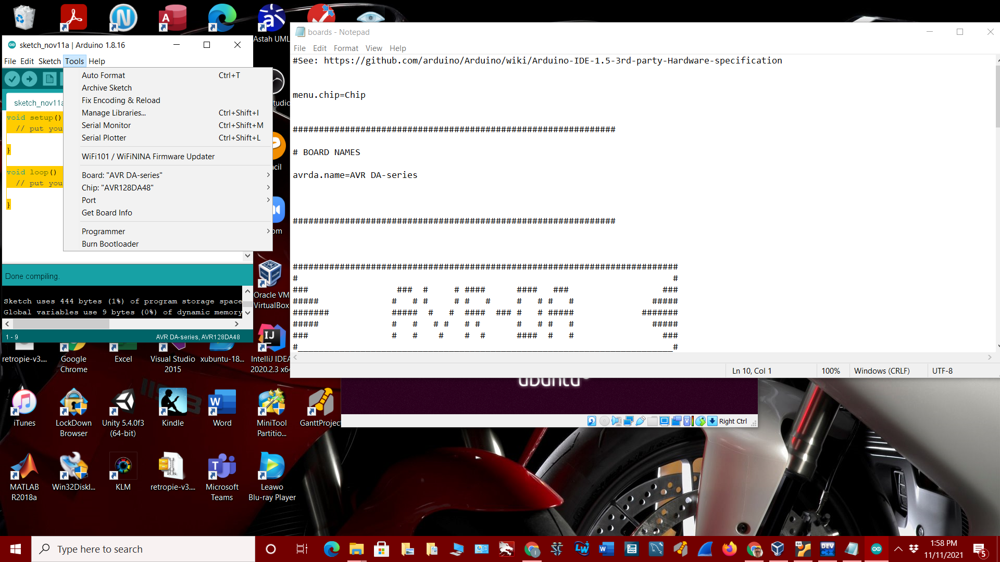
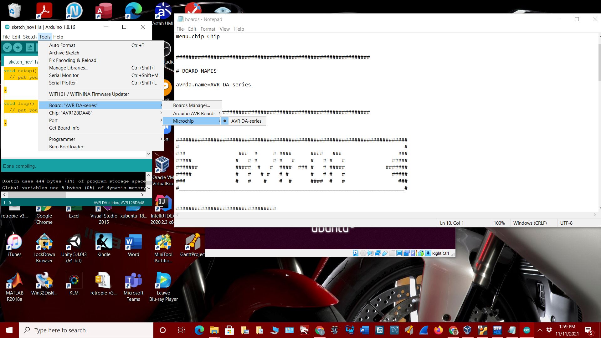
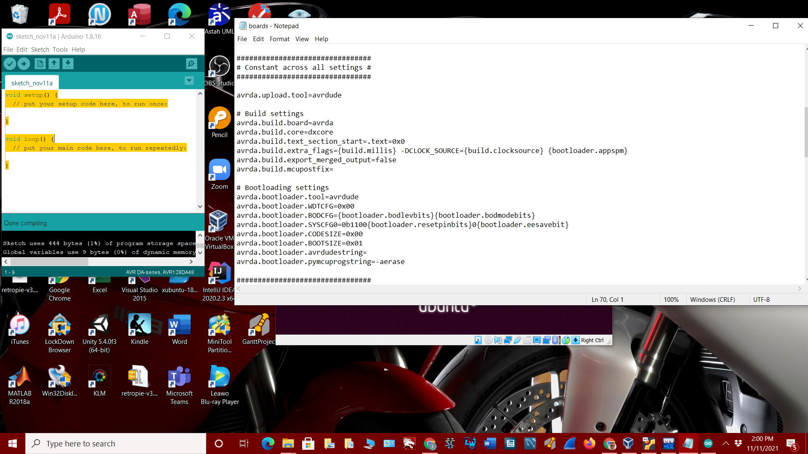
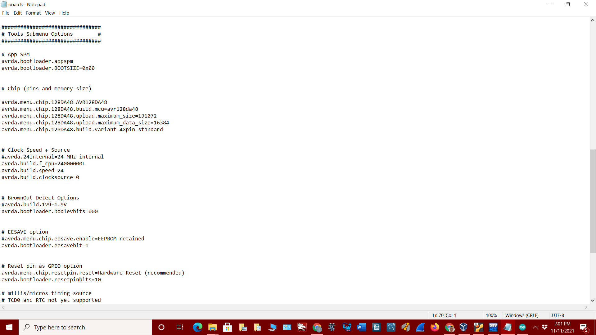
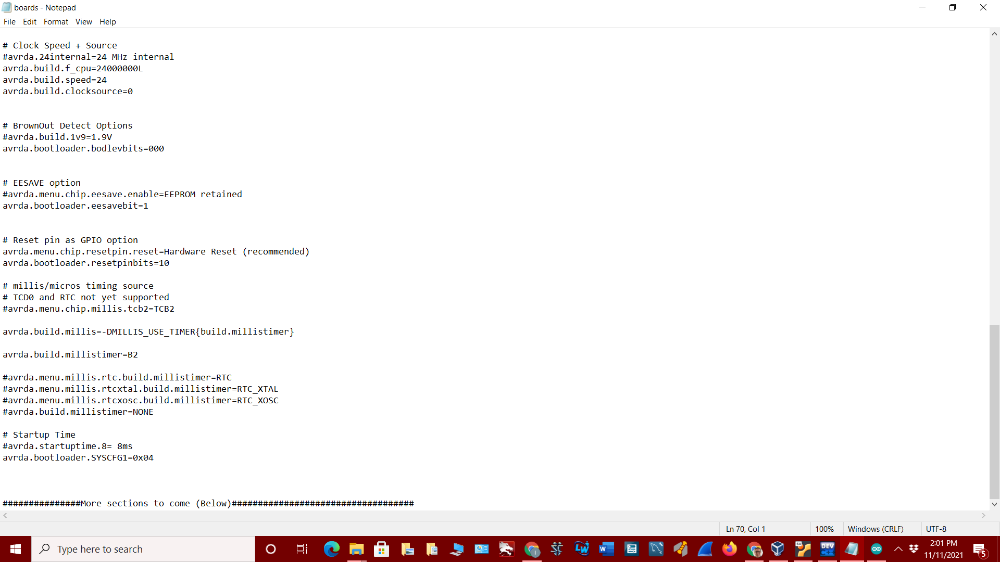

# Section xx: How to create a Boards.txt file

Start by creating a .txt file which will be basis for the various boards and their options for the Arduino IDE Core
being created.  The boards and configurations written in the file can be displayed under the Tools menu option 
within the Arduino IDE.  Other options can be configured within the file as default and left out of the menu system of
the Arduino IDE.  To follow is a Boards.txt file for the Microchip AVR128DA48 board.       
### Create a .txt file named Boards, add the boards and configurations for the specific board being used within the Arduino IDE.
1. Create the menu option named Chip.  
	- Chip menu option. 
		
		
2. Create a heading named Board Names and add the desired boards.
	
3. Create and set build settings and bootloading settings for your desired board(s).
	- This will create constant settings for the board.
	
4. Create and set Tools submenu options that are default for the specific board.
	- This will set default submenu options for the specified board. 
	
5. Create and set other default options for the specified board.
	- These settings will make it so that the specific board can be programmed through the IDE.
	
