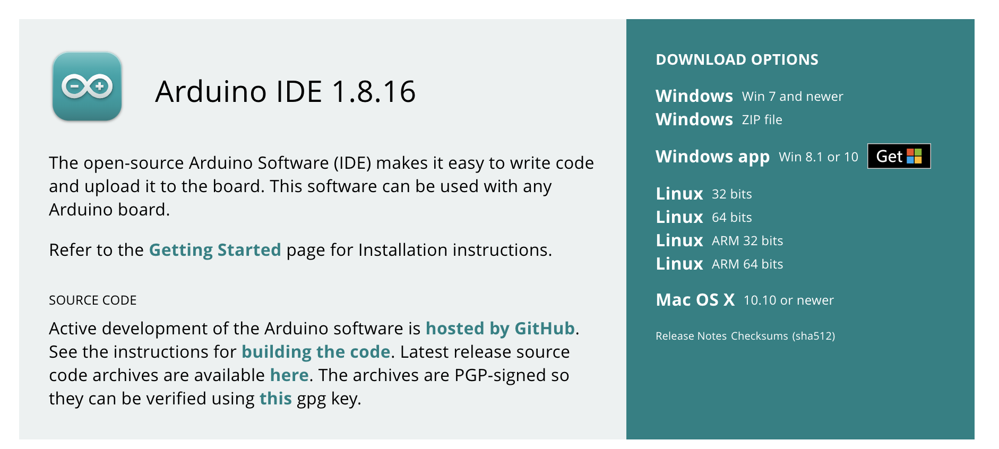
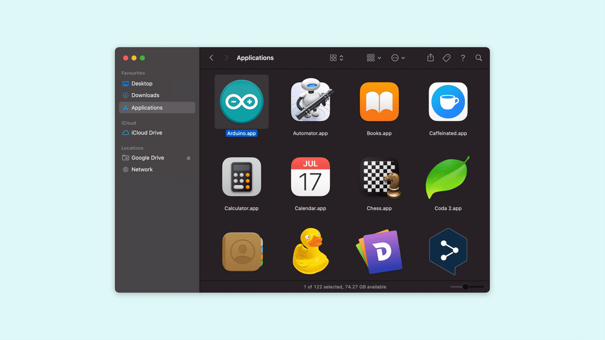

# Download Arduino IDE for Mac OS
1. Download the correct zip file for Mac_OS

    []

2. Find the file in the appropriate file path
3. Extract file [arduino-x.x.xx-macosx.zip] by double clicking
4. Follow the prompts to complete installation
5. Drag and drop the Arduino icon into the Applications folder when prompted

    []
