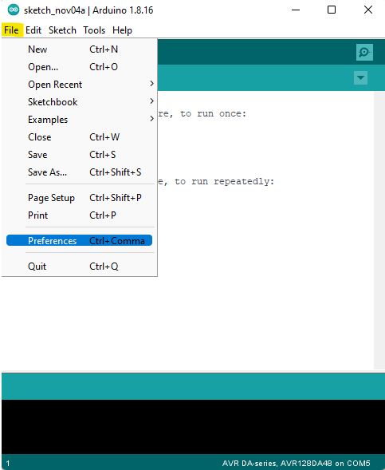
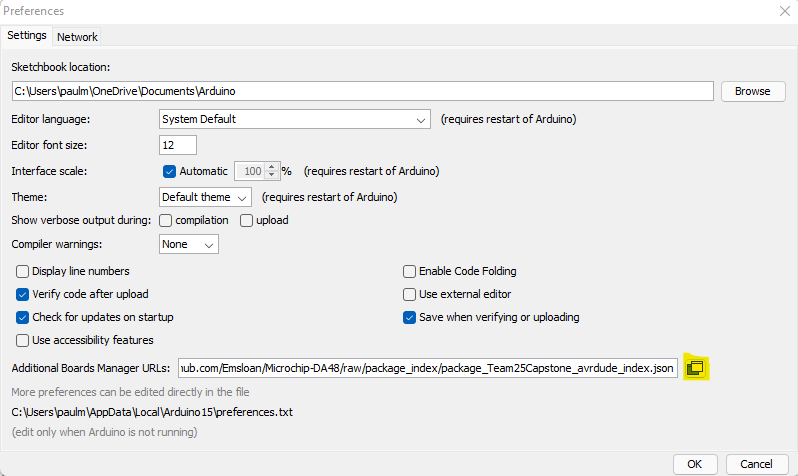
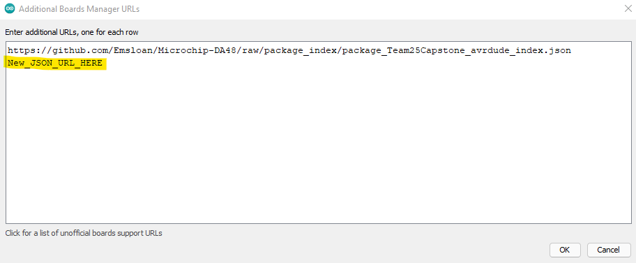
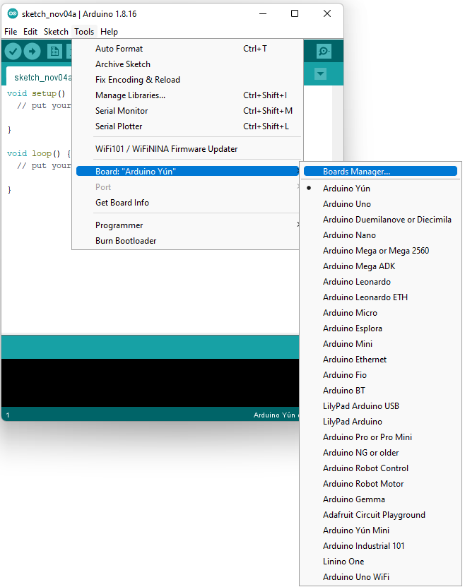
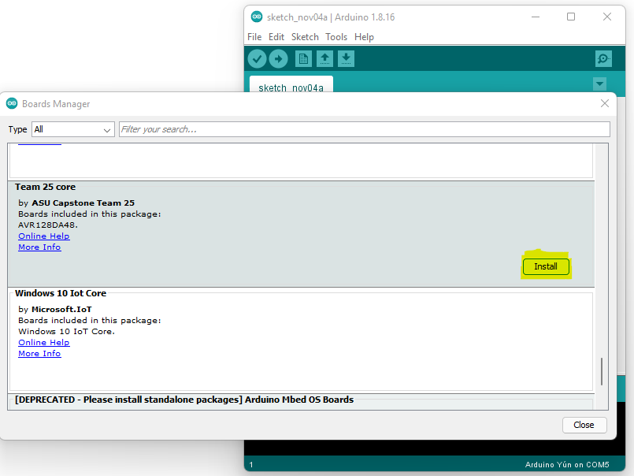
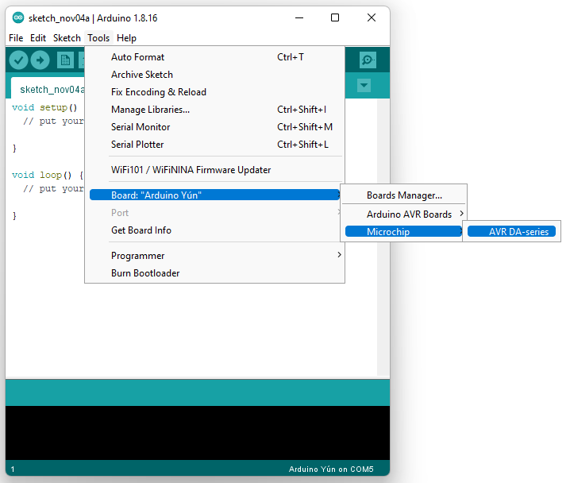

# Section xx: How to "Clean" the IDE

Starting with an Arduino IDE that does not contain any other packages is essential for testing
purposes.  An IDE with no other packages installed will be considered clean.  The IDE appears to have 
the ability to pull missing variables and tools from other packages that have been installed.  This 
means that testing a new package should be done on a "clean" version of the IDE.    

### Remove extra packages
1. Make sure the Arduino IDE and any associated files are closed.
2. Locate the Arduino15 folder.   
	- Path: "C:\Users\USERNAME\AppData\Local\Arduino15"  
	- On most Windows machines AppData will be a hidden folder, to show
	  the folder select folder options and click "Show hidden files, folders, and drives" under the
	  "Hidden files and folders" section.		
	   
		
3. Delete the Arduino15 folder.
	
4. Restart the Arduino IDE.
	- The IDE will generate a new empty Arduino15 folder.  

	
	### Before:
	
	### After:
	
	
&nbsp;
# Section xx: How to add a new Package
The IDE requires adding URLs pointing to JSON formatted files to install new core packages.  The structure of these 
JSONs is specified by the IDE and will point to necessary tools and information to allow for new boards to 
interact with the IDE.  Please see section xx in this document for more information about creating a JSON file.
&nbsp;
### Setting up a JSON file in the IDE
1. Click "File" menu and select the "Preferences" option.

2. In the Preferences menu, click the button to the far right of the "Additional Boards Manager URL" option.

3. Setting up a new JSON requires adding the URL to the next line in the "Additional Boards Manager".

&nbsp;
### Installing the Package
4. Click "Tools" menu and select "Board" followed by "Boards Manager". 

5. The boards manager will update the package options with the new package. 
6. Find the added package and select "Install".

7. Installed package will be available under the "Tools" - "Boards" menu.
