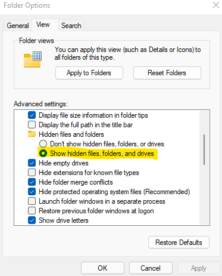

# Section xx: How to "Clean" the IDE

Starting with an Arduino IDE that does not contain any other packages is essential for testing
purposes.  An IDE with no other packages installed will be considered clean.  The IDE appears to have 
the ability to pull missing variables and tools from other packages that have been installed.  This 
means that testing a new package should be done on a "clean" version of the IDE.    

### Remove extra packages
1. Make sure the Arduino IDE and any associated files are closed.
2. Locate the Arduino15 folder.   
	- Path: "C:\Users\USERNAME\AppData\Local\Arduino15"  
	- On most Windows machines AppData will be a hidden folder, to show
	  the folder select folder options and click "Show hidden files, folders, and drives" under the
	  "Hidden files and folders" section.		
		
		
3. Delete the Arduino15 folder.
	
4. Restart the Arduino IDE.
	- The IDE will generate a new empty Arduino15 folder.  

	
	### Before:
	
	### After:
	