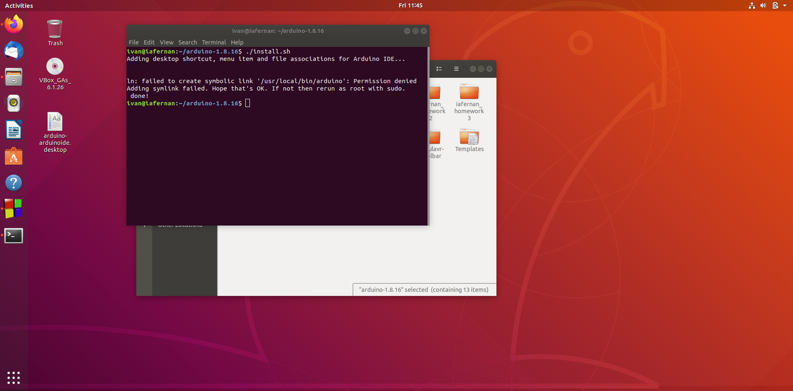

# Section xx: How to install IDE in Ubuntu

Start by creating a a virtual machine in VirtualBox with Ubuntu installed within it, or setup a 
computer with installing Ubuntu on it.  Donwload the latest version of Arduino IDE software from the 
Arduino website, select the Linux 64 bits option.    
### Download the software, extract the files and install
1. Locate the downloaded folder and extract it onto your system.  
	- Path: "home/USERNAME/Downloads"  
		
	- Right click on the file folder and select extract to extract the files into the home directory.		
		
		
2. Install the Arduino IDE.  Right click the Arduino IDE folder in home and select Open in Terminal.
	
3. Within the terminal type "./install.sh" to install the Arduino IDE.
	- This will generate a homescreen icon for the IDE software.  Double click it to run it. 
	
	