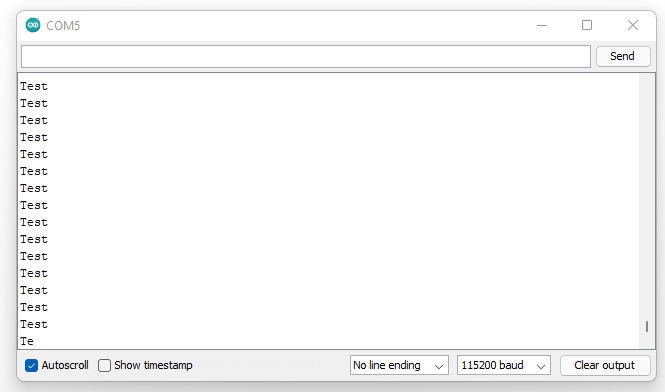
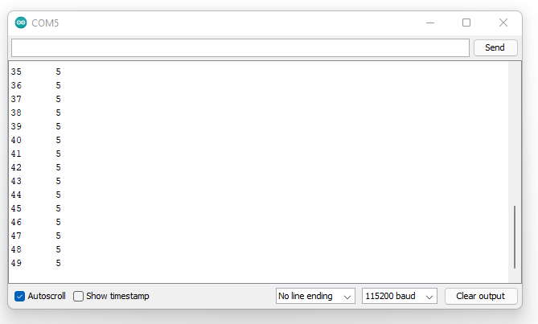
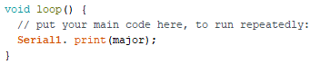
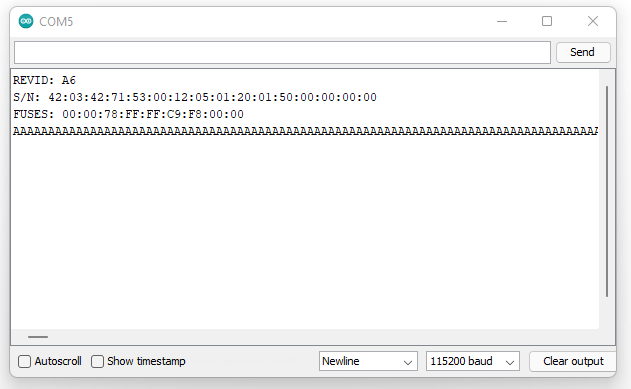
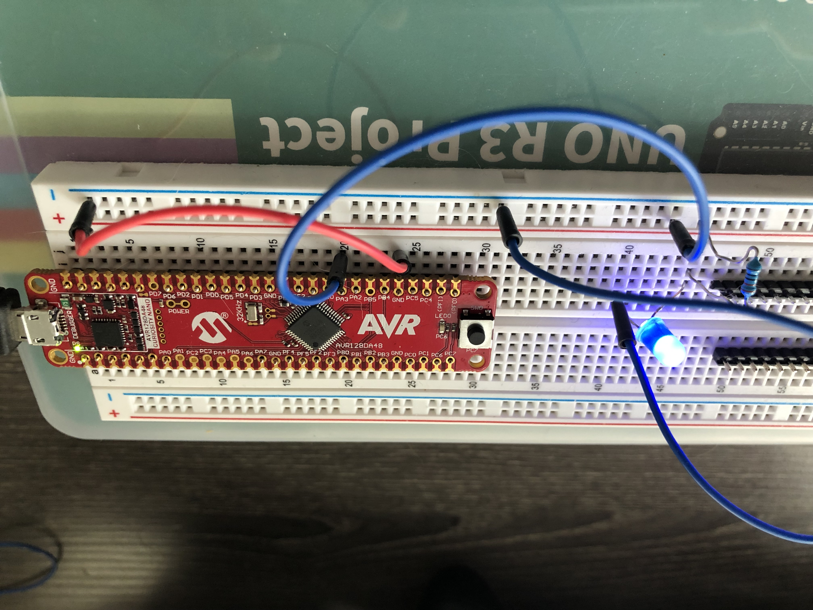
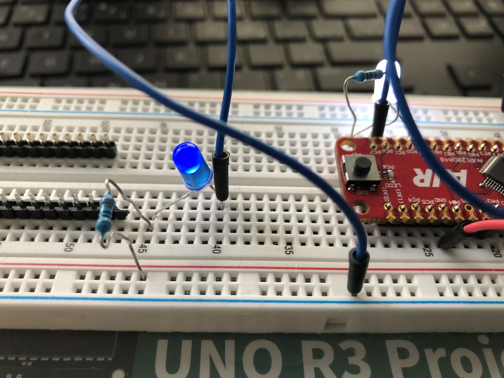
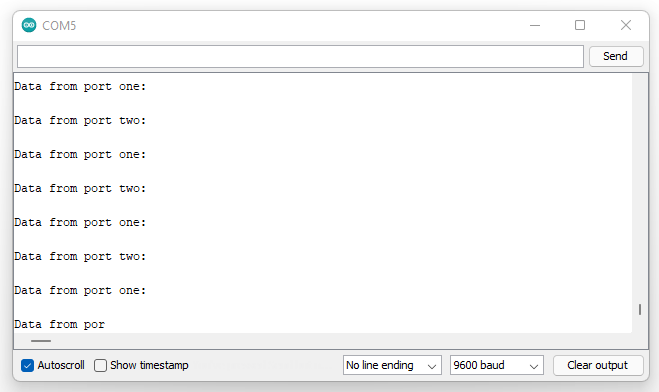

# Comparator - Simple_comparator

### Example Code
```
/***********************************************************************|
| AVR DA/DB analog comparator library                                   |
|                                                                       |
| Simple_comparator.ino                                                 |
|                                                                       |
| A library for interfacing with the AVR DA/DB analog comparator.       |
| Developed in 2019 by MCUdude                                          |
| https://github.com/MCUdude/                                           |
|                                                                       |
| In this example we use the negative and positive input 0 of the       |
| comparator. The output goes high if the positive input is higher than |
| the negative input, and low otherwise.                                |
|***********************************************************************/

#include <Comparator.h>

void setup() {
  // Configure relevant comparator parameters
  Comparator.input_p = in_p::in0;  // Use positive input 0 (PD2)
  Comparator.input_n = in_n::in0;  // Use negative input 0 (PD3)
  Comparator.output = out::enable; // Enable output on digital pin 7 (PA7)

  // Initialize comparator
  Comparator.init();

  // Start comparator
  Comparator.start();
}

void loop() {

}
```

### Result
Example failed to compile

### Error Message
```
Arduino: 1.8.16 (Windows 10), Board: "AVR DA-series, AVR128DA48"

C:\Users\paulm\AppData\Local\Arduino15\packages\Microchip\hardware\megaavr\1.0.0\libraries\Comparator\src\Comparator.cpp:134:6: error: prototype for 'void AnalogComparator::stop()' does not match any in class 'AnalogComparator'

 void AnalogComparator::stop() {

      ^~~~~~~~~~~~~~~~

In file included from C:\Users\paulm\AppData\Local\Arduino15\packages\Microchip\hardware\megaavr\1.0.0\libraries\Comparator\src\Comparator.cpp:1:0:

C:\Users\paulm\AppData\Local\Arduino15\packages\Microchip\hardware\megaavr\1.0.0\libraries\Comparator\src\Comparator.h:90:10: error: candidate is: void AnalogComparator::stop(bool)

     void stop(bool restorepins = false);

          ^~~~

C:\Users\paulm\AppData\Local\Arduino15\packages\Microchip\hardware\megaavr\1.0.0\libraries\Comparator\src\Comparator.cpp: In member function 'void AnalogComparator::attachInterrupt(void (*)(), uint8_t)':

C:\Users\paulm\AppData\Local\Arduino15\packages\Microchip\hardware\megaavr\1.0.0\libraries\Comparator\src\Comparator.cpp:139:3: error: 'AC_INTMODE_NORMAL_t' was not declared in this scope

   AC_INTMODE_NORMAL_t intmode;

   ^~~~~~~~~~~~~~~~~~~

C:\Users\paulm\AppData\Local\Arduino15\packages\Microchip\hardware\megaavr\1.0.0\libraries\Comparator\src\Comparator.cpp:139:3: note: suggested alternative: 'AC_INTMODE_t'

   AC_INTMODE_NORMAL_t intmode;

   ^~~~~~~~~~~~~~~~~~~

   AC_INTMODE_t

C:\Users\paulm\AppData\Local\Arduino15\packages\Microchip\hardware\megaavr\1.0.0\libraries\Comparator\src\Comparator.cpp:143:7: error: 'intmode' was not declared in this scope

       intmode = (AC_INTMODE_NORMAL_t)AC_INTMODE_NORMAL_POSEDGE_gc;

       ^~~~~~~

C:\Users\paulm\AppData\Local\Arduino15\packages\Microchip\hardware\megaavr\1.0.0\libraries\Comparator\src\Comparator.cpp:143:7: note: suggested alternative: 'pinMode'

       intmode = (AC_INTMODE_NORMAL_t)AC_INTMODE_NORMAL_POSEDGE_gc;

       ^~~~~~~

       pinMode

C:\Users\paulm\AppData\Local\Arduino15\packages\Microchip\hardware\megaavr\1.0.0\libraries\Comparator\src\Comparator.cpp:160:16: error: 'intmode' was not declared in this scope

   AC.INTCTRL = intmode | AC_CMP_bm;

                ^~~~~~~

C:\Users\paulm\AppData\Local\Arduino15\packages\Microchip\hardware\megaavr\1.0.0\libraries\Comparator\src\Comparator.cpp:160:16: note: suggested alternative: 'pinMode'

   AC.INTCTRL = intmode | AC_CMP_bm;

                ^~~~~~~

                pinMode

exit status 1

Error compiling for board AVR DA-series.


This report would have more information with
"Show verbose output during compilation"
option enabled in File -> Preferences.

```

### Ideas
1. Add a declaration for "void stop()" in Comparator.h file.  It appears there is no declaration for this function.
2. Find location of missing "AC_INTMODE_NORMAL_t" enum declaration or add a new one. 

```
Search "AC_INTMODE_NORMAL_t" (1 hit in 1 file of 439 searched)
  C:\Users\paulm\AppData\Local\Arduino15\packages\Microchip\hardware\megaavr\1.0.0\libraries\DxCore\keywords.txt (1 hit)
	Line 278: AC_INTMODE_NORMAL_t	LITERAL1
```
A search performed only found one mention of the "AC_INTMODE_NORMAL_t".  It is contained in the keywords.txt file and is not attached
to any coding within the core.


# Comparator - Interrupt
### Example Code
```
/***********************************************************************|
| AVR DA/DB analog comparator library                                   |
|                                                                       |
| Interrupt.ino                                                         |
|                                                                       |
| A library for interfacing with the AVR DA/DB analog comparator.       |
| Developed in 2019 by MCUdude                                          |
| https://github.com/MCUdude/                                           |
|                                                                       |
| In this example we use an internal reference voltage instead of an    |
| external one on the negative pin. This eliminates the need for an     |
| external voltage divider to generate a reference. Note that the       |
| internal reference requires a stable voltage to function properly.    |
| Instead of using a physical output pin we're instead triggering an    |
| interrupt that will run a user defined function.                      |
|                                                                       |
| This is the formula for the generated voltage:                        |
| Vdacref = (DACREF / 256) * Vref                                       |
|***********************************************************************/

#include <Comparator.h>
/* This flag will be set true by the interrupt. Since it's modified in
 * an interrupt but read outside of that interrupt, it must be volatile.
 */
volatile bool int_fired = 0;

void setup() {
  // Configure serial port
  Serial.begin(115200);

  // Configure relevant comparator parameters
  Comparator.input_p = in_p::in0;       // Use positive input 0 (PD2)
  Comparator.input_n = in_n::dacref;    // Connect the negative pin to the DACREF voltage
  Comparator.reference = ref::vref_2v5; // Set the DACREF voltage to 2.5V
  Comparator.dacref = 255;              // Gives us 2.5V -> (255 / 256) * 2.5V = 2.5V
  Comparator.hysteresis = hyst::large;  // Use a 50mV hysteresis
  Comparator.output = out::disable;     // Use interrupt trigger instead of output pin

  // Initialize comparator
  Comparator.init();

  // Set interrupt (supports RISING, FALLING and CHANGE)
  Comparator.attachInterrupt(interruptFunction, RISING);

  // Start comparator
  Comparator.start();
}

void loop() {
  if (int_fired) { // Check our flag here
    Serial.println("Output of analog comparator went high!");
    int_fired = 0; // clear our flag so we don't sit there spamming the serial port
  }
}

// This function runs when an interrupt occurs
void interruptFunction() {
  /* You might want to do this, but no! Do not do this!
  Serial.println("Output of analog comparator went high!");
  * Avoid printing to serial within an ISR. The print functions can potentially block for,
  * in the worst case (tx buffer full when print is started), as long as the entire string
  * takes to print (calculated as characters divided by baud/10 - each byte is sent as
  * 10 bits, because there's a start and stop bit. At best, this would cause millis to lose
  * time, and at worst block other critical functions. If you really need to, printing a
  * single character is much less of a hazard than a longer message, and is acceptable for
  * debugging purposes (though still undesirable), as that both reduces the worst case
  * execution time and reduces the chance of there being any blocking delay- only a completely
  * full TX buffer would cause it. This also makes it harder for the interrupt to fire so
  * frequently that the messages it tries to print will outrun the serial port - which is the
  * nightmare scenario.
  * The correct approach is what we demonstrate - set a flag that you can check on the
  * next pass through loop.
  */
  int_fired = 1; // This can be kept short and fast,
}
```
### Result
Example failed to compile

### Error Message
```
Arduino: 1.8.16 (Windows 10), Board: "AVR DA-series, AVR128DA48"

C:\Users\paulm\AppData\Local\Arduino15\packages\Microchip\hardware\megaavr\1.0.0\libraries\Comparator\src\Comparator.cpp: In member function 'void AnalogComparator::attachInterrupt(void (*)(), uint8_t)':

C:\Users\paulm\AppData\Local\Arduino15\packages\Microchip\hardware\megaavr\1.0.0\libraries\Comparator\src\Comparator.cpp:670:3: error: 'AC_INTMODE_NORMAL_t' was not declared in this scope

   AC_INTMODE_NORMAL_t intmode;

   ^~~~~~~~~~~~~~~~~~~

C:\Users\paulm\AppData\Local\Arduino15\packages\Microchip\hardware\megaavr\1.0.0\libraries\Comparator\src\Comparator.cpp:670:3: note: suggested alternative: 'AC_INTMODE_t'

   AC_INTMODE_NORMAL_t intmode;

   ^~~~~~~~~~~~~~~~~~~

   AC_INTMODE_t

C:\Users\paulm\AppData\Local\Arduino15\packages\Microchip\hardware\megaavr\1.0.0\libraries\Comparator\src\Comparator.cpp:674:7: error: 'intmode' was not declared in this scope

       intmode = (AC_INTMODE_NORMAL_t)AC_INTMODE_NORMAL_POSEDGE_gc;

       ^~~~~~~

C:\Users\paulm\AppData\Local\Arduino15\packages\Microchip\hardware\megaavr\1.0.0\libraries\Comparator\src\Comparator.cpp:674:7: note: suggested alternative: 'pinMode'

       intmode = (AC_INTMODE_NORMAL_t)AC_INTMODE_NORMAL_POSEDGE_gc;

       ^~~~~~~

       pinMode

C:\Users\paulm\AppData\Local\Arduino15\packages\Microchip\hardware\megaavr\1.0.0\libraries\Comparator\src\Comparator.cpp:696:16: error: 'intmode' was not declared in this scope

   AC.INTCTRL = intmode | AC_CMP_bm;

                ^~~~~~~

C:\Users\paulm\AppData\Local\Arduino15\packages\Microchip\hardware\megaavr\1.0.0\libraries\Comparator\src\Comparator.cpp:696:16: note: suggested alternative: 'pinMode'

   AC.INTCTRL = intmode | AC_CMP_bm;

                ^~~~~~~

                pinMode

exit status 1

Error compiling for board AVR DA-series.
```
### Ideas
1. The error message points to the same missing type as the Comparator - Simple_comparator.  This type is not declared anywhere in our 
core's package and doesn't appear in the original DxCore either.  It must be added or the example must be modified.

#### Search of Team 25's package
```
Search "AC_INTMODE_NORMAL_t" (5 hits in 2 files of 465 searched)
  C:\Users\paulm\AppData\Local\Arduino15\packages\Microchip\hardware\megaavr\1.0.0\libraries\Comparator\src\Comparator.cpp (4 hits)
	Line 670:   AC_INTMODE_NORMAL_t intmode;
	Line 674:       intmode = (AC_INTMODE_NORMAL_t)AC_INTMODE_NORMAL_POSEDGE_gc;
	Line 677:       intmode = (AC_INTMODE_NORMAL_t)AC_INTMODE_NORMAL_NEGEDGE_gc;
	Line 680:       intmode = (AC_INTMODE_NORMAL_t)AC_INTMODE_NORMAL_BOTHEDGE_gc;
  C:\Users\paulm\AppData\Local\Arduino15\packages\Microchip\hardware\megaavr\1.0.0\libraries\DxCore\keywords.txt (1 hit)
	Line 278: AC_INTMODE_NORMAL_t	LITERAL1
```
#### Search of current DxCore
```
Search "AC_INTMODE_NORMAL_t" (5 hits in 2 files of 613 searched)
  D:\Homework\Capstone\DXCore\DxCore\megaavr\libraries\Comparator\src\Comparator.cpp (4 hits)
	Line 670:   AC_INTMODE_NORMAL_t intmode;
	Line 674:       intmode = (AC_INTMODE_NORMAL_t)AC_INTMODE_NORMAL_POSEDGE_gc;
	Line 677:       intmode = (AC_INTMODE_NORMAL_t)AC_INTMODE_NORMAL_NEGEDGE_gc;
	Line 680:       intmode = (AC_INTMODE_NORMAL_t)AC_INTMODE_NORMAL_BOTHEDGE_gc;
  D:\Homework\Capstone\DXCore\DxCore\megaavr\libraries\DxCore\keywords.txt (1 hit)
	Line 278: AC_INTMODE_NORMAL_t	LITERAL1
```

# EEPROM - eeprom_clear
### Example Code
```
/*
 * EEPROM Clear
 *
 * Sets all of the bytes of the EEPROM to 0xFF (blank).
 * Please see eeprom_iteration for a more in depth
 * look at how to traverse the EEPROM.
 *
 * This example code is in the public domain.
 */

#include <EEPROM.h>

void setup() {
  // initialize the LED pin as an output.
  pinMode(20, OUTPUT);

  /*
   * Iterate through each byte of the EEPROM storage.

   * Larger AVR processors have larger EEPROM sizes, E.g:
   * tinyAVR 0/1/2-series 2k flash:      64b
   * tinyAVR 0/1/2-series 4-8k flash:    128b
   * tinyAVR 0/1/2-series 16-32k flash:  256b
   * megaAVR 0-series:                   256b (all flash sizes)
   * DA, DB, EA-series:                  512b (all flash sizes)
   * DD-series:                          256b (all flash sizes)

   * Rather than hard-coding the length, you should use the pre-provided length function.
   * This will make your code portable to all AVR processors.
   */

  for (int i = 0 ; i < EEPROM.length() ; i++) {
    EEPROM.write(i, 0xFF);
  }

  // turn the LED on when we're done
  digitalWrite(20, HIGH);
}

void loop() {
  /* Empty loop.  */
}
```
Note: Code slightly modified to utilize the built in LED on pin 20.  

### Result
Example compiled and behaved correctly.  

# EEPROM - eeprom_crc
### Example Code
```
/* CRC eeprom validation example
 *
 * Written by Christopher Andrews.
 * CRC algorithm generated by pycrc, MIT licence ( https://github.com/tpircher/pycrc ).
 *
 * A CRC is a simple way of checking whether data has changed or become corrupted.
 * This example calculates a CRC value directly on the EEPROM values.
 * The purpose of this example is to highlight how the EEPROM object can be used just like an array.
 *
 * As well as, apparently demonstrating a CRC implementation instead of using the
 * builtin library from avr-libc "util/crc16.h"?
 * 16-bit CRC is probably a better match for the resources of an AVR, and
 * that implementation was done in assembly and is lightning fast.
 * This one is - maybe not even a sound implementation of a CRC algorithm...
 * Those rightshifts don't roll anything over, while every other CRC implementation
 * I've looked at does.  -Spence Konde 2021
 */

#include <Arduino.h>
#include <EEPROM.h>

void setup() {

  //Start serial
  Serial.begin(115200);

  //Print length of data to run CRC on.
  Serial.print("EEPROM length: ");
  Serial.println(EEPROM.length());

  //Print the result of calling eeprom_crc()
  Serial.print("CRC32 of EEPROM data: 0x");
  Serial.println(eeprom_crc(), HEX);
  Serial.print("\n\nDone!");
}

void loop() {
  /* Empty loop */
}

unsigned long eeprom_crc(void) {

  const unsigned long crc_table[16] = {
    0x00000000, 0x1db71064, 0x3b6e20c8, 0x26d930ac,
    0x76dc4190, 0x6b6b51f4, 0x4db26158, 0x5005713c,
    0xedb88320, 0xf00f9344, 0xd6d6a3e8, 0xcb61b38c,
    0x9b64c2b0, 0x86d3d2d4, 0xa00ae278, 0xbdbdf21c
  };

  unsigned long crc = ~0L;

  for (int index = 0 ; index < EEPROM.length()  ; ++index) {
    crc = crc_table[(crc ^ EEPROM[index]) & 0x0f] ^ (crc >> 4);
    crc = crc_table[(crc ^ (EEPROM[index] >> 4)) & 0x0f] ^ (crc >> 4);
    crc = ~crc;
  }
  return crc;
}
```

### Result
Code compiles correctly, but the serial monitor displays nothing.

### Ideas
1. Changing the "Serial" variable to "Serial1", which works in other sketches, has no effect on the serial monitor's output.   

# EEPROM - eeprom_get

### Sample Code
```
/* eeprom_get example.
 *
 * This shows how to use the EEPROM.get() method.
 *
 * To pre-set the EEPROM data, run the example sketch eeprom_put.
 * This sketch will run without it, however, the values shown
 * will be shown from what ever is already on the EEPROM.
 *
 * This may cause the serial object to print out a large string
 * of garbage if there is no null character inside one of the strings
 * loaded.
 *
 * Written by Christopher Andrews 2015
 * Released under MIT licence.
 */

#include <EEPROM.h>

void setup() {

  float f = 0.00f;   //Variable to store data read from EEPROM.
  int eeAddress = 0; //EEPROM address to start reading from

  Serial.begin(115200);

  Serial.print("Read float from EEPROM: ");

  //Get the float data from the EEPROM at position 'eeAddress'
  EEPROM.get(eeAddress, f);
  Serial.println(f, 3);    //This may print 'ovf, nan' if the data inside the EEPROM is not a valid float.

  /*
   * As get also returns a reference to 'f', you can use it inline.
   * E.g: Serial.print( EEPROM.get( eeAddress, f ) );
   */

  /*
   * Get can be used with custom structures too.
   * I have separated this into an extra function.
   */

  secondTest(); //Run the next test.
}

struct MyObject {
  float field1;
  byte field2;
  char name[10];
};

void secondTest() {
  int eeAddress = sizeof(float); //Move address to the next byte after float 'f'.

  MyObject customVar; //Variable to store custom object read from EEPROM.
  EEPROM.get(eeAddress, customVar);

  Serial.println("Read custom object from EEPROM: ");
  Serial.println(customVar.field1);
  Serial.println(customVar.field2);
  Serial.println(customVar.name);
}

void loop() {
  /* Empty loop  */
}
```

### Result
Code compiles correctly, but the serial monitor displays nothing.

### Ideas
1. Changing the code to "Serial1" has no effect on the output of this example.  
2. It appears that the serial monitor will only output data when a print function call is
placed in the void loop() and the variable is set to "Serial1".   
3. We need to figure out why the placement of print function calls affects the output to the serial monitor. 

### Example of Findings
```
void secondTest() {
  int eeAddress = sizeof(float); //Move address to the next byte after float 'f'.

  MyObject customVar; //Variable to store custom object read from EEPROM.
  EEPROM.get(eeAddress, customVar);

  Serial1.println("Read custom object from EEPROM: ");
  Serial1.println(customVar.field1);
  Serial1.println(customVar.field2);
  Serial1.println(customVar.name);
}

void loop() {
  /* Empty loop  */
  Serial1.println("Read float from EEPROM: "); //Adding this line and changing to "Serial1" will print to serial monitor
}
```

# EEPROM - Iteration
### Sample Code
```
/* eeprom_iteration example.
 *
 * A set of example snippets highlighting the
 * simplest methods for traversing the EEPROM.
 *
 * Running this sketch is not necessary, this is
 * simply highlighting certain programming methods.
 *
 * Written by Christopher Andrews 2015
 * Released under MIT licence.
 */

#include <EEPROM.h>

void setup() {

  /*
   * Iterate the EEPROM using a for loop.
   */

  for (int index = 0 ; index < EEPROM.length() ; index++) {

    //Add one to each cell in the EEPROM
    EEPROM[ index ] += 1;
  }

  /*
   * Iterate the EEPROM using a while loop.
   */

  int index = 0;

  while (index < EEPROM.length()) {

    //Add one to each cell in the EEPROM
    EEPROM[ index ] += 1;
    index++;
  }

  /*
   * Iterate the EEPROM using a do-while loop.
   */

  int idx = 0;  //Used 'idx' to avoid name conflict with 'index' above.

  do {

    //Add one to each cell in the EEPROM
    EEPROM[ idx ] += 1;
    idx++;
  } while (idx < EEPROM.length());


} //End of setup function.

void loop() {}
```

### Result
Code compiles correctly and appears to function properly.

# EEPROM - eeprom_put
### Sample Code
```
/* eeprom_put example.
 *
 * This shows how to use the EEPROM.put() method.
 * Also, this sketch will pre-set the EEPROM data for the
 * example sketch eeprom_get.
 *
 * Note, unlike the single byte version EEPROM.write(),
 * the put method will use update semantics. As in a byte
 * will only be written to the EEPROM if the data is actually
 * different in order to avoid unnecessary write/erase cycles.
 *
 * Written by Christopher Andrews 2015
 * Released under MIT licence.
 */

#include <EEPROM.h>

struct MyObject {
  float field1;
  byte field2;
  char name[10];
};

void setup() {

  Serial.begin(115200);

  float f = 123.456f;  //Variable to store in EEPROM.
  int eeAddress = 0;   //Location we want the data to be put.


  // One simple call, with the address first and the object second.
  EEPROM.put(eeAddress, f);

  Serial.println("Written float data type!");

  /* Put is designed for use with custom structures also. */

  //Data to store.
  MyObject customVar = {
    3.14f,
    65,
    "Working!"
  };

  eeAddress += sizeof(float); //Move address to the next byte after float 'f'.

  EEPROM.put(eeAddress, customVar);
  Serial.print("Written custom data type! \n\nView the example sketch eeprom_get to see how you can retrieve the values!");
}

void loop() {
  /* Empty loop */
}
```
### Result
Code compiles correctly, but the serial monitor displays nothing.

### Ideas
1. Serial1 works to print to the serial monitor but only if it is placed in the continuous loop.

```
void loop() {
  /* Empty loop */
  Serial1.println("Test");
}
```



# EEPROM - eeprom_read

### Sample Code
```
/* EEPROM Read
 *
 * Reads the value of each byte of the EEPROM and prints it
 * to the computer.
 * This example code is in the public domain.
 */

#include <EEPROM.h>

// start reading from the first byte (address 0) of the EEPROM
int address = 0;
byte value;

void setup() {
  Serial.begin(115200);
}

void loop() {
  // read a byte from the current address of the EEPROM
  value = EEPROM.read(address);

  Serial.print(address);
  Serial.print("\t");
  Serial.print(value, DEC);
  Serial.println();

  /*
   * Iterate through each byte of the EEPROM storage.

   * Larger AVR processors have larger EEPROM sizes, E.g:
   * tinyAVR 0/1/2-series 2k flash:      64b
   * tinyAVR 0/1/2-series 4-8k flash:    128b
   * tinyAVR 0/1/2-series 16-32k flash:  256b
   * megaAVR 0-series:                   256b (all flash sizes)
   * DA, DB, EA-series:                  512b (all flash sizes)
   * DD-series:                          256b (all flash sizes)

   * Rather than hard-coding the length, you should use the pre-provided length function.
   * This will make your code portable to all AVR processors.
   */

  address = address + 1;
  if (address == EEPROM.length()) {
    address = 0;
  }

  /*
   * As the EEPROM sizes are powers of two, wrapping (preventing overflow) of an
   * EEPROM address is also doable by a bitwise and of the length - 1.

   * ++address &= EEPROM.length() - 1;
   */

  delay(500);
}
```
### Result
Code compiles correctly and output is printed to the serial monitor.  This occurs only when 'Serial'
is changed to 'Serial1'.



# DxCore - EnhancedIODemo
### Sample Code
```
/*********************\\*****************************//************************
                       \\   Enhanced I/O API Demo   //
                        ^^-------------------------^^

The hardware in modern AVR devices (Dx, tinyAVR 0/1/2, mega 0-series) is more
sophisticated than that which was featured in previous AVR products. This core
provides a few simple I/O functions to take advantage of the new pin I/O
capabilities. This file demonstrates their function and calling conventions in
brief.

In these examples, we pick a pin that we know the part has -PIN_PA2 on tinyAVR
and PIN_PD4 for everything else - all ATtiny have PA0~PA3, PA6,and PA7; PA0 is
generally not available as it's used for UPDI.

Now, we could have also used PIN_PA1 - that works on all parts, except that on
the DD and DB-series, that pin may be used for a crystal, making it ill-suited
for use in a demonstration.

This sketch isn't meant to be used as is - it's more of a starting point, or
resource to cooy+paste starting points from.

******************************************************************************/

#if defined (MEGATINYCORE)
  #define DEMO_PIN PIN_PA2
  #define DEMO_PIN2 PIN_PA3
#else
  #define DEMO_PIN PIN_PD4
  #define DEMO_PIN2 PIN_PD5

#endif

void setup() {


}


void loop() {
  openDrainBitbang(0x0DF0AD8B); //or, with human endianness, 0x8BADF00D
}

/*-----------------------------------------------------------------------------
openDrain(pin,value) and openDrainFast(pin,value)

Nothing specific to the modernAVRs about openDrain() - it's the "missing"
digital I/O function. To get pullup, set it INPUT_PULLUP with pinMode first, then
call openDrain() - remember that, emulating the behavior of classic AVRs, the
core configures pins as inputs unless told otherwise.
  Usage:
    openDrain(DEMO_PIN, LOW);
    openDrain(DEMO_PIN, FLOATING);
    openDrain(DEMO_PIN, CHANGE);
    openDrainFast(DEMO_PIN, LOW);
    openDrainFast(DEMO_PIN, FLOATING);
    openDrainFast(DEMO_PIN, CHANGE);

  LOW sets pin mode to OUTPUT.
  FLOATING sets pin mode to INPUT. If there is a pullup
enabled or external pullup connected, the pin will be pulled up assuming
nothing else connected to it is driving the pin LOW; otherwise the pin will
float.
  CHANGE toggles the direction.

  Like all Fast I/O functions, you must pass a constant pin and you should try
  to pass a constant value as well. The function when both are constant, and
  the value is not CHANGE optimizes to a single cbi or sbi instruction, occupying
  2 bytes of flash and executing within a single clock cycle. This function is
  ((always_inline)) - but with a single 2 byte instruction, this is always
  more efficient. When the value is CHANGE, it uses two instructions, one a
  double-size STS instruction, for 6 bytes and 3 clock cycles.

-----------------------------------------------------------------------------*/

void openDrainBitbang(uint32_t data) {
  pinMode(DEMO_PIN, INPUT_PULLUP);
  pinMode(DEMO_PIN2, INPUT_PULLUP);
  openDrain(DEMO_PIN, FLOATING);
  openDrain(DEMO_PIN2, FLOATING);
  // Now both pins are open drains with their pullup enabled
  // now they use one as a clock, and the other as data in some sort of digital
  // communication scheme waiting to make sure the pins come back to HIGH like
  // I2C does.
  // When it's not waiting for the pins to rise back to HIGH, the code runs
  for (uint8_t i = 0; i < 32; i++) {
    while (digitalReadFast(DEMO_PIN) != HIGH || digitalReadFast(DEMO_PIN2) != HIGH);
    //Wait for them to be pulled high - probably won't loop, but maybe high capacitance on
    //the lines or weak pullups, or other device holding low (like I2C clock stretching)
    _NOPNOP(); // wait four clocks so the receiver has a chance to see the same thing as we did; We could even wait longer here
    _NOPNOP();
    if (((uint8_t)data) & 0x01) {
      openDrainFast(DEMO_PIN2, LOW); ///set up data line - this likely compiles to cbi, sbrc, sbi
      // (certainly that's what you;'d expect the compiler to to do, but sometimes it's not so smart)
    }
    _NOPNOP(); // wait four clocks so the receiver has a chance to see the same thing as we did; We could even wait longer here
    _NOPNOP();
    openDrainFast(DEMO_PIN, LOW);
    data >>= 1;  //if we'd immediately released it, it would only be low for a fraction of a microsecond.
    // doing that math in there is liks a quarter microsecond delay.
    openDrainFast(DEMO_PIN, FLOATING);
    openDrainFast(DEMO_PIN2, FLOATING);
    //release pins.
  }

}
```
### Result
Code compiles correctly

# DxCore - ModernRevSer
### Code Sample

```
/* Read the silicon revision of a "modern" (post-2016, AVRxt) part, including megaAVR 0-series,
 * tinyAVR 0/1/2-series, AVR Dx-series, and likely the upcoming AVR Ex-series.
 * classic AVRs do not have a uniform serial number scheme like the new ones do. Some have one
 * located in the sigrow, others do not.
 * Also reads out the fuses and serial number. The fuses and serial number were part of an
 * attempt to determine whether the date code was embedded into the serial number somehow.
 * I suspect it is possible to determine the date code from it in some way.
 * A few interesting things to note about the serial number:
 *    The data bytes do not appear to use the full range of values - for
 *        most bytes, if you print each byte as hex, you get 2 decimal
 *        digits, that is, it's BCD.
 *    What little entropy it provides entropy is not distributed uniformly
 *        across the serial number. That is to say, it's a serial number,
 *        not a hash of a serial number. Don't count on it being impossible
 *        to guess the serial number.
 *    For these reasons, it is possible that additional information can be deduced from it
 *    In fact, on the Dx-series, the IO header identifies the meaning of each byte! Based on the similarity
 *    of the values observed in the wild, it is likely that the numbering scheme is similar for other parts.
 *  LOTNUM0:LOTNUM1:LOTNUM2:LOTNUM3:LOTNUM4:LOTNUM5  6 bytes of lot number
 *  RANDOM :SCRIBE : XPOS0 : XPOS1 : YPOS0 : YPOS1   1 random, unsure what "scribe" is, and 2 bytes each for X and Y position of die on wafer
 *   RES0  : RES1  : RES2  : RES3                    4 "reserved" bytes
 */


#if (__AVR_ARCH__ < 100)
  #error "This sketch is designed for 'modern AVR' parts only (post-2016, when they revised peripherals and instruction set timing)"
#endif
void setup() {
  Serial.begin(115200);
  Serial.println();
  delay(1000);
  Serial.print("REVID: ");
  #ifdef SIGROW_SERNUM15 //AVR Dx-series= - different format
  char major = 0x40 + (SYSCFG.REVID >> 4);
  Serial.print(major);
  Serial.println(SYSCFG.REVID & 0x0F);
  #else
  Serial.println('@' + SYSCFG.REVID);
  #endif
  Serial.print("S/N: ");
  volatile uint8_t *mptr = &SIGROW_SERNUM0;
  showHex(*mptr++);
  for (byte i = 0; i < 15; i++) {
    Serial.print(':');
    showHex(*mptr++);
  }
  Serial.println();
  Serial.print("FUSES: ");
  mptr = FUSES_START;
  showHex(*mptr++);
  for (byte i = 1; i < 9; i++) {
    Serial.print(':');
    showHex(*mptr++);
  }
  Serial.println();
}

void showHex(const byte b) {
  char x = (b >> 4) | '0';
  if (x > '9') {
    x += 7;
  }
  Serial.write(x);
  x = (b & 0x0F) | '0';
  if (x > '9') {
    x += 7;
  }
  Serial.write(x);
}

void loop() {
  // put your main code here, to run repeatedly:

}
```
### Result
Code compiles correctly and output is printed to the serial monitor.  This occurs only when serial
is set to 'Serial1'.

### Ideas
1.  Moving the "major" variable into the void loop() function will print the value stored in the char variable.





# DxCore - SAMPLENDemo

### Sample code
```
/*
ADC0.SAMPCTRL demo

Connect a 1 MEG resistor between PD1 and PD0.

This makes PD0 a very high impedance input, controlled by PD1.
This sketch flips PD1 and then immediately takes some readings on PD0, printing the first one.
Format output is conducive to graphing in excel/etc (save as .csv)
One thing that is important to remember is that what matters is what the last voltage READ BY the ADC was.
For example, if you switch back and forth between reading a high impedance source, and a voltage very close to ground,
your numbers will err low with a low SAMPLEN, while if you were last measuring a high voltage, if would err high.
This of course means that if you are continually measuring the same high impedance, but slow changing voltage, you can
afford to use a shorter sample length than if you were switching between multiple analog voltages.

And finally, notice how it is slower when the change is from low to high vs high to low - which strikes me as
rather odd. Also that it goes all the way to 0 on a LOW, but not all the way to 4095 on a HIGH.


*/

void setup() {
  pinMode(PIN_PD1, OUTPUT);
  digitalWrite(PIN_PD1, 0);
  ADC0.SAMPCTRL = 0xFF;
  analogReadResolution(12);
  Serial.begin(1000000);
  delay(1000);
  analogRead(PIN_PD0);
}

void loop() {
  ADC0.SAMPCTRL++;
  digitalWrite(PIN_PD1, 1);
  Serial.print(analogRead(PIN_PD0));
  analogRead(PIN_PD0);
  analogRead(PIN_PD0);
  analogRead(PIN_PD0);
  analogRead(PIN_PD0);
  analogRead(PIN_PD0);
  analogRead(PIN_PD0);
  analogRead(PIN_PD0);
  Serial.print(",");
  digitalWrite(PIN_PD1, 0);
  Serial.println(analogRead(PIN_PD0));
  analogRead(PIN_PD0);
  analogRead(PIN_PD0);
  analogRead(PIN_PD0);
  analogRead(PIN_PD0);
  analogRead(PIN_PD0);
  analogRead(PIN_PD0);
  analogRead(PIN_PD0);
  if (ADC0.SAMPCTRL == 255) {
    while (1);
  }
}
```

### Result
Code compiles correctly and output is printed to the serial monitor.  This occurs only when 'Serial'
is set to 'Serial1'.

# Opamp - Inverting_amplifier

### Sample code
```
/***********************************************************************|
| AVR-DB Opamp library                                                  |
|                                                                       |
| Inverting_amplifier.ino                                               |
|                                                                       |
| A library for interfacing with the built-in AVR-DB Opamps             |
| Developed in 2021 by MCUdude                                          |
| https://github.com/MCUdude/                                           |
|                                                                       |
| In this example we use opamp 0 as an inverting amplifier with a gain  |
| multiplier set by the built-in resistor ladder. Since the output      |
| can't go below 0V, we center the output voltage around Vdd/2, which   |
| is 5V if your supply voltage is 5V. This means that if 1.5V is        |
| applied to PD3, PD2 will output 3.5V.                                 |
|                                                                       |
|                 | Gain   |  Wiper value  | R1  | R2  |                |
|                 |--------|---------------|-----|-----|                |
|                 | -0.067 | wiper::wiper0 | 60k | 4k  |                |
|                 | -0.143 | wiper::wiper1 | 56k | 8k  |                |
|                 | -0.334 | wiper::wiper2 | 48k | 16k |                |
|                 | -1.00  | wiper::wiper3 | 32k | 32k |                |
|                 | -1.667 | wiper::wiper4 | 24k | 40k |                |
|                 | -3.00  | wiper::wiper5 | 16k | 48k |                |
|                 | -7.00  | wiper::wiper6 | 8k  | 56k |                |
|                 | -15.0  | wiper::wiper7 | 4k  | 60k |                |
|                                                                       |
|               ______           ______                                 |
|      PD3 ----|__R1__|----+----|__R2__|----+                           |
|                          |                |                           |
|                          |    |\          |                           |
|                          |    |  \        |                           |
|                          +----| -  \      |                           |
|                               |     |-----+----- PD2                  |
|                     Vdd/2 ----| +  /                                  |
|                               |  /                                    |
|                               |/              Gain = - (R2 / R1)      |
|                                                                       |
|                                                                       |
| See Microchip's application note TB3286 for more information.         |
|***********************************************************************/

#include <Opamp.h>

void setup() {
  // Configure opamp input pins
  Opamp0.input_n = in_n::wiper;    // Connect negative input to the "middle" position of the resistor ladder
  Opamp0.input_p = in_p::vdd_div2; // Connect positive input to Vdd/2 internally

  // Configure resistor ladder
  Opamp0.ladder_top = top::output;     // Connect the resistor ladder top to the opamp output
  Opamp0.ladder_bottom = bottom::in_n; // Connect the resistor ladder bottom to the negative input pin, which is PD3
  Opamp0.ladder_wiper = wiper::wiper3; // Set a gain of -1

  // Enable opamp output
  Opamp0.output = out::enable;

  // Initialize Opamp0
  Opamp0.init();

  // Start the Opamp hardware
  Opamp::start();
}

void loop() {

}
```

### Result
Code fails to compile.

### Error Message
```
Arduino: 1.8.16 (Windows 10), Board: "AVR DA-series, AVR128DA48"

C:\Users\paulm\AppData\Local\Arduino15\packages\Microchip\hardware\megaavr\1.0.0\libraries\Opamp\examples\Inverting_amplifier\Inverting_amplifier.ino: In function 'void setup()':

Inverting_amplifier:46:3: error: 'Opamp0' was not declared in this scope

   Opamp0.input_n = in_n::wiper;    // Connect negative input to the "middle" position of the resistor ladder

   ^~~~~~

C:\Users\paulm\AppData\Local\Arduino15\packages\Microchip\hardware\megaavr\1.0.0\libraries\Opamp\examples\Inverting_amplifier\Inverting_amplifier.ino:46:3: note: suggested alternative: 'Opamp'

   Opamp0.input_n = in_n::wiper;    // Connect negative input to the "middle" position of the resistor ladder

   ^~~~~~

   Opamp

exit status 1

'Opamp0' was not declared in this scope


This report would have more information with
"Show verbose output during compilation"
option enabled in File -> Preferences.
```
### Ideas
1. The Opamp0 variable is not being set in the library.  
```
// Pre-defined objects
#if defined(OPAMP_OP0CTRLA)
  Opamp Opamp0(PIN_PD1, PIN_PD2, PIN_PD3, 0, OPAMP_OP0CTRLA, OPAMP_OP0STATUS, OPAMP_OP0RESMUX, OPAMP_OP0INMUX, OPAMP_OP0SETTLE, OPAMP_OP0CAL);
#endif
#if defined(OPAMP_OP1CTRLA)
  Opamp Opamp1(PIN_PD4, PIN_PD5, PIN_PD7, 1, OPAMP_OP1CTRLA, OPAMP_OP1STATUS, OPAMP_OP1RESMUX, OPAMP_OP1INMUX, OPAMP_OP1SETTLE, OPAMP_OP1CAL);
#endif
#if defined(OPAMP_OP2CTRLA)
  Opamp Opamp2(PIN_PE1, PIN_PE2, PIN_PE3, 2, OPAMP_OP2CTRLA, OPAMP_OP2STATUS, OPAMP_OP2RESMUX, OPAMP_OP2INMUX, OPAMP_OP2SETTLE, OPAMP_OP2CAL);
#endif
```
This code defines the Opamp variables if another variable, OPAMP_OPxCTRLA, has been defined and is not null.
A search of the DxCore returns no definitions or declarations for any of these variables.
```   
Search "OPAMP_OP0CTRLA" (6 hits in 2 files of 465 searched)
  C:\Users\paulm\AppData\Local\Arduino15\packages\Microchip\hardware\megaavr\1.0.0\libraries\DxCore\keywords.txt (4 hits)
	Line 3720: OPAMP_OP0CTRLA_OUTMODE_OFF_gc	KEYWORD3	RESERVED_WORD
	Line 3721: OPAMP_OP0CTRLA_OUTMODE_NORMAL_gc	KEYWORD3	RESERVED_WORD
	Line 3722: OPAMP_OP0CTRLA_OUTMODE_t	LITERAL1
	Line 3876: OPAMP_OP0CTRLA	LITERAL1
  C:\Users\paulm\AppData\Local\Arduino15\packages\Microchip\hardware\megaavr\1.0.0\libraries\Opamp\src\Opamp.cpp (2 hits)
	Line 5: #if defined(OPAMP_OP0CTRLA)
	Line 6:   Opamp Opamp0(PIN_PD1, PIN_PD2, PIN_PD3, 0, OPAMP_OP0CTRLA, OPAMP_OP0STATUS, OPAMP_OP0RESMUX, OPAMP_OP0INMUX, OPAMP_OP0SETTLE, OPAMP_OP0CAL);
```
2. It is possible that the selected "Op_num" needs to be declared in the IDE example file.

# Opamp - Inverting_amplifier_with_follower

### Sample Code
```
/***********************************************************************|
| AVR-DB Opamp library                                                  |
|                                                                       |
| Inverting_amplifier_with_follower.ino                                 |
|                                                                       |
| A library for interfacing with the built-in AVR-DB Opamps             |
| Developed in 2021 by MCUdude                                          |
| https://github.com/MCUdude/                                           |
|                                                                       |
| In this example we use opamp 0 as voltage follower to drive the       |
| inverting opamp 1. Since the output can't go below 0V, we center the  |
| output voltage around Vdd/2, which is 5V if your supply voltage is    |
| 5V. This means that if 1.5V is applied to PD1, PD5 will output 3.5V.  |
|                                                                       |
|                 | Gain   |  Wiper value  | R1  | R2  |                |
|                 |--------|---------------|-----|-----|                |
|                 | -0.067 | wiper::wiper0 | 60k | 4k  |                |
|                 | -0.143 | wiper::wiper1 | 56k | 8k  |                |
|                 | -0.334 | wiper::wiper2 | 48k | 16k |                |
|                 | -1.00  | wiper::wiper3 | 32k | 32k |                |
|                 | -1.667 | wiper::wiper4 | 24k | 40k |                |
|                 | -3.00  | wiper::wiper5 | 16k | 48k |                |
|                 | -7.00  | wiper::wiper6 | 8k  | 56k |                |
|                 | -15.0  | wiper::wiper7 | 4k  | 60k |                |
|          |\                                                           |
|          |  \                                                         |
|  PD1 ----| +  \           ______           ______                     |
|          | OP0 |----+----|__R1__|----+----|__R2__|----+               |
|     +----| -  /     |                |                |               |
|     |    |  /       |                |    |\          |               |
|     |    |/         |                |    |  \        |               |
|     |               |                +----| -  \      |               |
|     +---------------+                     | OP1 |-----+----- PD5      |
|                                 Vdd/2 ----| +  /                      |
|                                           |  /                        |
|                                           |/      Gain = - (R2 / R1)  |
|                                                                       |
|                                                                       |
| See Microchip's application note TB3286 for more information.         |
|***********************************************************************/

#include <Opamp.h>

void setup() {
  // Configure Opamp0 as a voltage follower tied to the Opamp1 resistor ladder
  Opamp0.input_p = in_p::pin;    // Connect positive input to external input pin (PD1)
  Opamp0.input_n = in_n::output; // Connect negative input to the opamp output
  Opamp0.output  = out::enable;  // Enable output

  // Configure Opamp1 pins
  Opamp1.input_n = in_n::wiper;    // Connect negative input to the "middle" position of the resistor ladder
  Opamp1.input_p = in_p::vdd_div2; // Connect positive input to Vdd/2 internally
  Opamp1.output  = out::enable;    // Enable output

  // Configure Opamp1 resistor ladder
  Opamp1.ladder_top    = top::output;   // Connect the resistor ladder top to the opamp output
  Opamp1.ladder_bottom = bottom::link;  // Connect the resistor ladder bottom to the output of the previous opamp
  Opamp1.ladder_wiper  = wiper::wiper3; // Set a gain of -1

  // Initialize Opamps
  Opamp0.init();
  Opamp1.init();

  // Start the Opamp hardware
  Opamp::start();
}

void loop() {

}
```
### Result
The Code failed to compile.

### Error Message
```
Arduino: 1.8.16 (Windows 10), Board: "AVR DA-series, AVR128DA48"

C:\Users\paulm\AppData\Local\Arduino15\packages\Microchip\hardware\megaavr\1.0.0\libraries\Opamp\examples\Inverting_amplifier_with_follower\Inverting_amplifier_with_follower.ino: In function 'void setup()':

Inverting_amplifier_with_follower:51:3: error: 'Opamp1' was not declared in this scope

   Opamp1.input_n = in_n::wiper;    // Connect negative input to the "middle" position of the resistor ladder

   ^~~~~~

C:\Users\paulm\AppData\Local\Arduino15\packages\Microchip\hardware\megaavr\1.0.0\libraries\Opamp\examples\Inverting_amplifier_with_follower\Inverting_amplifier_with_follower.ino:51:3: note: suggested alternative: 'Opamp0'

   Opamp1.input_n = in_n::wiper;    // Connect negative input to the "middle" position of the resistor ladder

   ^~~~~~

   Opamp0

exit status 1

'Opamp1' was not declared in this scope


This report would have more information with
"Show verbose output during compilation"
option enabled in File -> Preferences.
```
### Ideas
1. 'Opamp0' and 'Opamp1' objects are both undefined when being called in the example.  This seems to be related
to the 'OPAMP_OPxCTRLA' being null.

# Opamp - Non_inverting_amplifier

### Sample Code
```
/***********************************************************************|
| AVR-DB Opamp library                                                  |
|                                                                       |
| Non_inverting_amplifier.ino                                           |
|                                                                       |
| A library for interfacing with the built-in AVR-DB Opamps             |
| Developed in 2021 by MCUdude                                          |
| https://github.com/MCUdude/                                           |
|                                                                       |
| In this example we use opamp 0 as a non-inverting amplifier with a    |
| gain multiplier set by the built-in resistor ladder.                  |
|                                                                       |
|                 | Gain |  Wiper value  | R1  | R2  |                  |
|                 |------|---------------|-----|-----|                  |
|                 | 1.06 | wiper::wiper0 | 60k | 4k  |                  |
|                 | 1.14 | wiper::wiper1 | 56k | 8k  |                  |
|                 | 1.33 | wiper::wiper2 | 48k | 16k |                  |
|                 | 2.00 | wiper::wiper3 | 32k | 32k |                  |
|                 | 2.66 | wiper::wiper4 | 24k | 40k |                  |
|                 | 4.00 | wiper::wiper5 | 16k | 48k |                  |
|                 | 8.00 | wiper::wiper6 | 8k  | 56k |                  |
|                 | 15.0 | wiper::wiper7 | 4k  | 60k |                  |
|                                                                       |
|                          |\                                           |
|                          |  \                                         |
|                 PD1 -----| +  \                                       |
|                          |     |-----+----- PD2                       |
|                     +----| -  /      |                                |
|                     |    |  /        |                                |
|                     |    |/          |        Gain = 1 + (R2 / R1)    |
|          ______     |     ______     |                                |
|    +----|__R1__|----+----|__R2__|----+                                |
|    |                                                                  |
|   ___                                                                 |
|    -                                                                  |
|                                                                       |
| See Microchip's application note TB3286 for more information.         |
|***********************************************************************/

#include <Opamp.h>

void setup() {
  // Configure opamp input pins
  Opamp0.input_p = in_p::pin;   // Connect positive input to external input pin (PD1)
  Opamp0.input_n = in_n::wiper; // Connect negative input to the "middle" position of the resistor ladder

  // Configure resistor ladder
  Opamp0.ladder_top    = top::output;   // Connect the resistor ladder top to the opamp output
  Opamp0.ladder_bottom = bottom::gnd;   // Connect the resistor ladder bottom to ground
  Opamp0.ladder_wiper  = wiper::wiper3; // Set a gain of two

  // Enable opamp output
  Opamp0.output = out::enable;

  // Initialize Opamp0
  Opamp0.init();

  // Start the Opamp hardware
  Opamp::start();
}

void loop() {

}
```

### Result
The code failed to compile.

### Error Message
```
Arduino: 1.8.16 (Windows 10), Board: "AVR DA-series, AVR128DA48"

C:\Users\paulm\AppData\Local\Arduino15\packages\Microchip\hardware\megaavr\1.0.0\libraries\Opamp\src\Opamp.cpp: In member function 'void Opamp::init()':

C:\Users\paulm\AppData\Local\Arduino15\packages\Microchip\hardware\megaavr\1.0.0\libraries\Opamp\src\Opamp.cpp:81:5: error: 'OPAMP_PWRCTRL' was not declared in this scope

     OPAMP_PWRCTRL  = inrange; // Select normal or rail to rail input mode

     ^~~~~~~~~~~~~

C:\Users\paulm\AppData\Local\Arduino15\packages\Microchip\hardware\megaavr\1.0.0\libraries\Opamp\src\Opamp.cpp: In static member function 'static void Opamp::start(bool)':

C:\Users\paulm\AppData\Local\Arduino15\packages\Microchip\hardware\megaavr\1.0.0\libraries\Opamp\src\Opamp.cpp:98:3: error: 'OPAMP_TIMEBASE' was not declared in this scope

   OPAMP_TIMEBASE = (ceil(F_CPU / 1000000L) - 1); // Calculate timebase based on F_CPU

   ^~~~~~~~~~~~~~

C:\Users\paulm\AppData\Local\Arduino15\packages\Microchip\hardware\megaavr\1.0.0\libraries\Opamp\src\Opamp.cpp:101:5: error: 'OPAMP_CTRLA' was not declared in this scope

     OPAMP_CTRLA |= OPAMP_ENABLE_bm;           // Enable opamp hardware

     ^~~~~~~~~~~

C:\Users\paulm\AppData\Local\Arduino15\packages\Microchip\hardware\megaavr\1.0.0\libraries\Opamp\src\Opamp.cpp:101:5: note: suggested alternative: 'SPI1_CTRLA'

     OPAMP_CTRLA |= OPAMP_ENABLE_bm;           // Enable opamp hardware

     ^~~~~~~~~~~

     SPI1_CTRLA

C:\Users\paulm\AppData\Local\Arduino15\packages\Microchip\hardware\megaavr\1.0.0\libraries\Opamp\src\Opamp.cpp:101:20: error: 'OPAMP_ENABLE_bm' was not declared in this scope

     OPAMP_CTRLA |= OPAMP_ENABLE_bm;           // Enable opamp hardware

                    ^~~~~~~~~~~~~~~

C:\Users\paulm\AppData\Local\Arduino15\packages\Microchip\hardware\megaavr\1.0.0\libraries\Opamp\src\Opamp.cpp:101:20: note: suggested alternative: 'AC_ENABLE_bm'

     OPAMP_CTRLA |= OPAMP_ENABLE_bm;           // Enable opamp hardware

                    ^~~~~~~~~~~~~~~

                    AC_ENABLE_bm

C:\Users\paulm\AppData\Local\Arduino15\packages\Microchip\hardware\megaavr\1.0.0\libraries\Opamp\src\Opamp.cpp:106:103: error: 'Opamp1' was not declared in this scope

     while ((!Opamp0.status() && (Opamp0.wait_settle == true && Opamp0.enable == enable::enable)) || (!Opamp1.status() && (Opamp1.wait_settle == true && Opamp1.enable == enable::enable)));

                                                                                                       ^~~~~~

C:\Users\paulm\AppData\Local\Arduino15\packages\Microchip\hardware\megaavr\1.0.0\libraries\Opamp\src\Opamp.cpp:106:103: note: suggested alternative: 'Opamp'

     while ((!Opamp0.status() && (Opamp0.wait_settle == true && Opamp0.enable == enable::enable)) || (!Opamp1.status() && (Opamp1.wait_settle == true && Opamp1.enable == enable::enable)));

                                                                                                       ^~~~~~

                                                                                                       Opamp

C:\Users\paulm\AppData\Local\Arduino15\packages\Microchip\hardware\megaavr\1.0.0\libraries\Opamp\src\Opamp.cpp:109:5: error: 'OPAMP_CTRLA' was not declared in this scope

     OPAMP_CTRLA &= ~OPAMP_ENABLE_bm; // Disable opamp hardware

     ^~~~~~~~~~~

C:\Users\paulm\AppData\Local\Arduino15\packages\Microchip\hardware\megaavr\1.0.0\libraries\Opamp\src\Opamp.cpp:109:5: note: suggested alternative: 'SPI1_CTRLA'

     OPAMP_CTRLA &= ~OPAMP_ENABLE_bm; // Disable opamp hardware

     ^~~~~~~~~~~

     SPI1_CTRLA

C:\Users\paulm\AppData\Local\Arduino15\packages\Microchip\hardware\megaavr\1.0.0\libraries\Opamp\src\Opamp.cpp:109:21: error: 'OPAMP_ENABLE_bm' was not declared in this scope

     OPAMP_CTRLA &= ~OPAMP_ENABLE_bm; // Disable opamp hardware

                     ^~~~~~~~~~~~~~~

C:\Users\paulm\AppData\Local\Arduino15\packages\Microchip\hardware\megaavr\1.0.0\libraries\Opamp\src\Opamp.cpp:109:21: note: suggested alternative: 'AC_ENABLE_bm'

     OPAMP_CTRLA &= ~OPAMP_ENABLE_bm; // Disable opamp hardware

                     ^~~~~~~~~~~~~~~

                     AC_ENABLE_bm

exit status 1

Error compiling for board AVR DA-series.


This report would have more information with
"Show verbose output during compilation"
option enabled in File -> Preferences.
```

### Ideas
1. More issues found with the init() function of the Opamp class.
2. Fixing the initiaion process of the Opamp class could be a solution to this issue. 

# Opamp - Voltage Follower
### Sample Code
```
/***********************************************************************|
| AVR-DB Opamp library                                                  |
|                                                                       |
| Voltage_follower.ino                                                  |
|                                                                       |
| A library for interfacing with the built-in AVR-DB Opamps             |
| Developed in 2021 by MCUdude                                          |
| https://github.com/MCUdude/                                           |
|                                                                       |
| In this example we use opamp 0 as a voltage follower.                 |
|                                                                       |
|                          |\                                           |
|                          |  \                                         |
|                 PD1 -----| +  \                                       |
|                          |     |-----+----- PD2                       |
|                     +----| -  /      |                                |
|                     |    |  /        |                                |
|                     |    |/          |      Gain = 1                  |
|                     |                |                                |
|                     +----------------+                                |
|                                                                       |
|                                                                       |
| See Microchip's application note TB3286 for more information.         |
|***********************************************************************/

#include <Opamp.h>

void setup() {
  // Configure opamp input pins
  Opamp0.input_p = in_p::pin;    // Connect positive input to external input pin (PD1)
  Opamp0.input_n = in_n::output; // Connect negative input to the opamp output

  // Enable opamp output
  Opamp0.output = out::enable;

  // Initialize Opamp0
  Opamp0.init();

  // Start the Opamp hardware
  Opamp::start();
}

void loop() {

}
```

### Result
The code fails to compile.

### Error Message
```
Arduino: 1.8.16 (Windows 10), Board: "AVR DA-series, AVR128DA48"

C:\Users\paulm\AppData\Local\Arduino15\packages\Microchip\hardware\megaavr\1.0.0\libraries\Opamp\src\Opamp.cpp: In member function 'void Opamp::init()':

C:\Users\paulm\AppData\Local\Arduino15\packages\Microchip\hardware\megaavr\1.0.0\libraries\Opamp\src\Opamp.cpp:81:5: error: 'OPAMP_PWRCTRL' was not declared in this scope

     OPAMP_PWRCTRL  = inrange; // Select normal or rail to rail input mode

     ^~~~~~~~~~~~~

C:\Users\paulm\AppData\Local\Arduino15\packages\Microchip\hardware\megaavr\1.0.0\libraries\Opamp\src\Opamp.cpp: In static member function 'static void Opamp::start(bool)':

C:\Users\paulm\AppData\Local\Arduino15\packages\Microchip\hardware\megaavr\1.0.0\libraries\Opamp\src\Opamp.cpp:98:3: error: 'OPAMP_TIMEBASE' was not declared in this scope

   OPAMP_TIMEBASE = (ceil(F_CPU / 1000000L) - 1); // Calculate timebase based on F_CPU

   ^~~~~~~~~~~~~~

C:\Users\paulm\AppData\Local\Arduino15\packages\Microchip\hardware\megaavr\1.0.0\libraries\Opamp\src\Opamp.cpp:101:5: error: 'OPAMP_CTRLA' was not declared in this scope

     OPAMP_CTRLA |= OPAMP_ENABLE_bm;           // Enable opamp hardware

     ^~~~~~~~~~~

C:\Users\paulm\AppData\Local\Arduino15\packages\Microchip\hardware\megaavr\1.0.0\libraries\Opamp\src\Opamp.cpp:101:5: note: suggested alternative: 'SPI1_CTRLA'

     OPAMP_CTRLA |= OPAMP_ENABLE_bm;           // Enable opamp hardware

     ^~~~~~~~~~~

     SPI1_CTRLA

C:\Users\paulm\AppData\Local\Arduino15\packages\Microchip\hardware\megaavr\1.0.0\libraries\Opamp\src\Opamp.cpp:101:20: error: 'OPAMP_ENABLE_bm' was not declared in this scope

     OPAMP_CTRLA |= OPAMP_ENABLE_bm;           // Enable opamp hardware

                    ^~~~~~~~~~~~~~~

C:\Users\paulm\AppData\Local\Arduino15\packages\Microchip\hardware\megaavr\1.0.0\libraries\Opamp\src\Opamp.cpp:101:20: note: suggested alternative: 'AC_ENABLE_bm'

     OPAMP_CTRLA |= OPAMP_ENABLE_bm;           // Enable opamp hardware

                    ^~~~~~~~~~~~~~~

                    AC_ENABLE_bm

C:\Users\paulm\AppData\Local\Arduino15\packages\Microchip\hardware\megaavr\1.0.0\libraries\Opamp\src\Opamp.cpp:106:103: error: 'Opamp1' was not declared in this scope

     while ((!Opamp0.status() && (Opamp0.wait_settle == true && Opamp0.enable == enable::enable)) || (!Opamp1.status() && (Opamp1.wait_settle == true && Opamp1.enable == enable::enable)));

                                                                                                       ^~~~~~

C:\Users\paulm\AppData\Local\Arduino15\packages\Microchip\hardware\megaavr\1.0.0\libraries\Opamp\src\Opamp.cpp:106:103: note: suggested alternative: 'Opamp'

     while ((!Opamp0.status() && (Opamp0.wait_settle == true && Opamp0.enable == enable::enable)) || (!Opamp1.status() && (Opamp1.wait_settle == true && Opamp1.enable == enable::enable)));

                                                                                                       ^~~~~~

                                                                                                       Opamp

C:\Users\paulm\AppData\Local\Arduino15\packages\Microchip\hardware\megaavr\1.0.0\libraries\Opamp\src\Opamp.cpp:109:5: error: 'OPAMP_CTRLA' was not declared in this scope

     OPAMP_CTRLA &= ~OPAMP_ENABLE_bm; // Disable opamp hardware

     ^~~~~~~~~~~

C:\Users\paulm\AppData\Local\Arduino15\packages\Microchip\hardware\megaavr\1.0.0\libraries\Opamp\src\Opamp.cpp:109:5: note: suggested alternative: 'SPI1_CTRLA'

     OPAMP_CTRLA &= ~OPAMP_ENABLE_bm; // Disable opamp hardware

     ^~~~~~~~~~~

     SPI1_CTRLA

C:\Users\paulm\AppData\Local\Arduino15\packages\Microchip\hardware\megaavr\1.0.0\libraries\Opamp\src\Opamp.cpp:109:21: error: 'OPAMP_ENABLE_bm' was not declared in this scope

     OPAMP_CTRLA &= ~OPAMP_ENABLE_bm; // Disable opamp hardware

                     ^~~~~~~~~~~~~~~

C:\Users\paulm\AppData\Local\Arduino15\packages\Microchip\hardware\megaavr\1.0.0\libraries\Opamp\src\Opamp.cpp:109:21: note: suggested alternative: 'AC_ENABLE_bm'

     OPAMP_CTRLA &= ~OPAMP_ENABLE_bm; // Disable opamp hardware

                     ^~~~~~~~~~~~~~~

                     AC_ENABLE_bm

exit status 1

Error compiling for board AVR DA-series.


This report would have more information with
"Show verbose output during compilation"
option enabled in File -> Preferences.
```

### Ideas 
1. The problem with this example seems to be linked to issues when the init() function is called for the 
Opamp class.

# Servo_DxCore - Knob

### Sample Code
```
/*
 Controlling a servo position using a potentiometer (variable resistor)
 by Michal Rinott <http://people.interaction-ivrea.it/m.rinott>

 modified on 8 Nov 2013
 by Scott Fitzgerald
 http://www.arduino.cc/en/Tutorial/Knob
*/

#include <Servo_DxCore.h>

Servo myservo;  // create servo object to control a servo

int potpin = A7;  // analog pin used to connect the potentiometer - analog channel 7 exists everywhere!
int val;    // variable to read the value from the analog pin

void setup() {
  myservo.attach(9);  // attaches the servo on pin 9 to the servo object
}

void loop() {
  val = analogRead(potpin);            // reads the value of the potentiometer (value between 0 and 1023)
  val = map(val, 0, 1023, 0, 180);     // scale it to use it with the servo (value between 0 and 180)
  myservo.write(val);                  // sets the servo position according to the scaled value
  delay(15);                           // waits for the servo to get there
}
```

### Results 
The code compiles correctly. 

# Servo_DxCore - ServoMaxTest

### Sample Code
```
/*
  Yes, this library *really* can drive 12 servos from a single type B timer!
*/

#include <Servo_DxCore.h>

Servo myservos[12];
byte pos[12];
char dir[12] = {1, 1, 1, 1, 1, 1, 1, 1, 1, 1, 1, 1};

void setup() {
  TCA0.SPLIT.CTRLA = 0;
  for (byte i = 0; i < 12; i++) {
    myservos[i].attach(i);
    pos[i] = i * 15;
  }
}

void loop() {
  for (byte i = 0; i < 12; i++) {
    myservos[i].write(pos[i]);
    pos[i] += dir[i];
    if (pos[i] == 180) {
      dir[i] = -1;
    }
    if (pos[i] == 0) {
      dir[i] = 1;
    }
  }
  delay(30);                       // waits 30ms for the servo to reach the position
}
```
### Results
The code compiles correctly.

# Servo_DxCore - Sweep

### Sample Code
```
/* Sweep
 by BARRAGAN <http://barraganstudio.com>
 This example code is in the public domain.

 modified 8 Nov 2013
 by Scott Fitzgerald
 http://www.arduino.cc/en/Tutorial/Sweep
*/

#include <Servo_DxCore.h>

Servo myservo;  // create servo object to control a servo
// twelve servo objects can be created on most boards

int pos = 0;    // variable to store the servo position

void setup() {
  myservo.attach(9);  // attaches the servo on pin 9 to the servo object
}

void loop() {
  for (pos = 0; pos <= 180; pos += 1) { // goes from 0 degrees to 180 degrees
    // in steps of 1 degree
    myservo.write(pos);              // tell servo to go to position in variable 'pos'
    delay(15);                       // waits 15ms for the servo to reach the position
  }
  for (pos = 180; pos >= 0; pos -= 1) { // goes from 180 degrees to 0 degrees
    myservo.write(pos);              // tell servo to go to position in variable 'pos'
    delay(15);                       // waits 15ms for the servo to reach the position
  }
}
```

### Results 
The code compiles correctly.

# Logic - Three_input_AND

### Sample Code
```
/***********************************************************************|
| megaAVR Configurable Custom Logic library                             |
|                                                                       |
| Three_input_AND.ino                                                   |
|                                                                       |
| A library for interfacing with the megaAVR Configurable Custom Logic. |
| Developed in 2019 by MCUdude.                                         |
| https://github.com/MCUdude/                                           |
|                                                                       |
| In this example we use the configurable logic peripherals the the     |
| megaAVR to create a 3-input AND gate using logic block 0 on PORT A.   |
| The example is pretty straight forward, but the truth table value may |
| be a little difficult to understand at first glance.                  |
| Here's how 0x80 turns out to be the correct value to create a 3-input |
| AND gate:                                                             |
|                                           3-input AND truth table:    |
| If we look at the truth table             |PA2|PA1|PA0| Y |           |
| to the right, we can see that             |---|---|---|---|           |
| all binary values for Y can               | 0 | 0 | 0 | 0 |           |
| be represented as 10000000.               | 0 | 0 | 1 | 0 |           |
| If we convert this 8-bit                  | 0 | 1 | 0 | 0 |           |
| binary number into hex, we                | 0 | 1 | 1 | 0 |           |
| get 0x80.                                 | 1 | 0 | 0 | 0 |           |
|                                           | 1 | 0 | 1 | 0 |           |
| In this example the output pin            | 1 | 1 | 0 | 0 |           |
| will go high if all three                 | 1 | 1 | 1 | 1 |           |
| inputs are high.                                                      |
|***********************************************************************/

#include <Logic.h>

void setup() {
  // Initialize logic block 0

  Logic0.enable = true;                 // Enable logic block 0
  Logic0.input0 = in::input_pullup;     // Set PA0 as input with pullup
  Logic0.input1 = in::input_pullup;     // Set PA1 as input with pullup
  Logic0.input2 = in::input_pullup;     // Set PA2 as input with pullup
  //Logic0.output_swap = out::pin_swap; // Uncomment this line to route the output to alternate location, if available.
  Logic0.output = out::enable;          // Enable logic block 0 output pin PA3 (if not remapped)
  Logic0.filter = filter::disable;      // No output filter enabled
  Logic0.truth = 0x80;                  // Set truth table

  // Initialize logic block 0
  Logic0.init();

  // Start the AVR logic hardware
  Logic::start();
}

void loop() {
  // When using configurable custom logic the CPU isn't doing anything!
}
```
 
### Result
Code compiles correctly but the output pin remains off regardless of the voltage sent to each
input.

### Notes
1. The output should go high when a voltage is applied to each input of the gate, but
the output remains low regardless of the input's status.


# Logic - Three_input_NAND

### Sample Code
```
/***********************************************************************|
| megaAVR Configurable Custom Logic library                             |
|                                                                       |
| Three_input_NAND.ino                                                  |
|                                                                       |
| A library for interfacing with the megaAVR Configurable Custom Logic. |
| Developed in 2019 by MCUdude.                                         |
| https://github.com/MCUdude/                                           |
|                                                                       |
| In this example we use the configurable logic peripherals the the     |
| megaAVR to create a 3-input NAND gate using logic block 0 on PORT A.  |
| The example is pretty straight forward, but the truth table value may |
| be a little difficult to understand at first glance.                  |
| Here's how 0x7F turns out to be the correct value to create a 3-input |
| NAND gate:                                                            |
|                                           3-input NAND truth table:   |
| If we look at the truth table             |PA2|PA1|PA0| Y |           |
| to the right, we can see that             |---|---|---|---|           |
| all binary values for Y can               | 0 | 0 | 0 | 1 |           |
| be represented as 01111111.               | 0 | 0 | 1 | 1 |           |
| If we convert this 8-bit                  | 0 | 1 | 0 | 1 |           |
| binary number into hex, we                | 0 | 1 | 1 | 1 |           |
| get 0x7F.                                 | 1 | 0 | 0 | 1 |           |
|                                           | 1 | 0 | 1 | 1 |           |
| In this example the output pin            | 1 | 1 | 0 | 1 |           |
| will go low if all three                  | 1 | 1 | 1 | 0 |           |
| inputs are high.                                                      |
|***********************************************************************/

#include <Logic.h>

void setup() {
  // Initialize logic block 0

  Logic0.enable = true;                 // Enable logic block 0

  Logic0.input0 = in::input_pullup;     // Set PA0 as input with pullup
  Logic0.input1 = in::input_pullup;     // Set PA1 as input with pullup
  Logic0.input2 = in::input_pullup;     // Set PA2 as input with pullup
  //Logic0.output_swap = out::pin_swap; // Uncomment this line to route the output to alternate location, if available.
  Logic0.output = out::enable;          // Enable logic block 0 output pin (PA3 (ATmega) or PA5 (ATtiny))
  Logic0.filter = filter::disable;      // No output filter enabled
  Logic0.truth = 0x7F;                  // Set truth table

  // Initialize logic block 0
  Logic0.init();

  // Start the AVR logic hardware
  Logic::start();
}

void loop() {
  // When using configurable custom logic the CPU isn't doing anything!
}
```
### Result
The code compiles correct but the logic gate appears to be functioning incorrectly.

### Notes
1. The ouput remains on regardless of the voltage being delivered to the inputs.

2. The inputs appear to be outputing a slight voltage, as a LED connected to the pin 
will dimly light up.  


# Logic - Three_input_OR

### Sample Code
```
/***********************************************************************|
| megaAVR Configurable Custom Logic library                             |
|                                                                       |
| Three_input_OR.ino                                                    |
|                                                                       |
| A library for interfacing with the megaAVR Configurable Custom Logic. |
| Developed in 2019 by MCUdude.                                         |
| https://github.com/MCUdude/                                           |
|                                                                       |
| In this example we use the configurable logic peripherals the the     |
| megaAVR to create a 3-input OR gate using logic block 0 on PORT A.    |
| The example is pretty straight forward, but the truth table value may |
| be a little difficult to understand at first glance.                  |
| Here's how 0xFE turns out to be the correct value to create a 3-input |
| OR gate:                                                              |
|                                           3-input OR truth table:     |
| If we look at the truth table             |PA2|PA1|PA0| Y |           |
| to the right, we can see that             |---|---|---|---|           |
| all binary values for Y can               | 0 | 0 | 0 | 0 |           |
| be represented as 11111110.               | 0 | 0 | 1 | 1 |           |
| If we convert this 8-bit                  | 0 | 1 | 0 | 1 |           |
| binary number into hex, we                | 0 | 1 | 1 | 1 |           |
| get 0xFE.                                 | 1 | 0 | 0 | 1 |           |
|                                           | 1 | 0 | 1 | 1 |           |
| In this example the output pin            | 1 | 1 | 0 | 1 |           |
| will go high if one or more               | 1 | 1 | 1 | 1 |           |
| inputs are high.                                                      |
|***********************************************************************/

#include <Logic.h>

void setup() {
  // Initialize logic block 0
  // Logic block 0 has three inputs, PA0, PA1 and PA2.
  // Because PA0 is shared with the UPDI pin and is not usually an option
  // we use PA3 via the event system in this example on ATtiny parts
  // It has one output, PA3 on ATmega, PA5 on ATtiny.
  // Or alternate output on PA6 on ATmega, PB6 on 20 and 24-pin ATtiny.

  pinMode(20, OUTPUT);
  digitalWrite(20, HIGH);
  
  Logic0.enable = true;               // Enable logic block 0

  Logic0.input0 = in::input_pullup;   // Set PA0 as input with pullup
  Logic0.input1 = in::input_pullup;   // Set PA1 as input with pullup
  Logic0.input2 = in::input_pullup;   // Set PA2 as input with pullup
  //Logic0.output_swap = out::pin_swap; // Uncomment this line to route the output to alternate location, if available.
  Logic0.output = out::enable;        // Enable logic block 0 output pin (PA3 (ATmega) or PA5 (ATtiny))
  Logic0.filter = filter::disable;    // No output filter enabled
  Logic0.truth = 0xFE;                // Set truth table

  // Initialize logic block 0
  Logic0.init();

  // Start the AVR logic hardware
  Logic::start();
}

void loop() {
  // When using configurable custom logic the CPU isn't doing anything!
}
```

### Result
The code compiles correctly, but the output is high even when the inputs are all low.

### Notes
1. According to the logic table, the ouput should be low if the three inputs are also low.  
This indicates that the logic gate is not functioning properly. 
2. The three inputs appear to be outputing a low level voltage, which can be seen when an LED
is connected to the pin.  The LED is dimly lit.



# Logic - Two_input_AND

### Sample Code
```
/***********************************************************************|
| megaAVR Configurable Custom Logic library                             |
|                                                                       |
| Two_input_AND.ino                                                     |
|                                                                       |
| A library for interfacing with the megaAVR Configurable Custom Logic. |
| Developed in 2019 by MCUdude. Example fixed Spence Konde 2021         |
| This version is part of DxCore for AVR DA, DB, etc. Example works for |
| megaAVR 0-series and tinyAVR 0/1/2-series as well.                    |
|                                                                       |
| In this example we use the configurable logic peripherals the the     |
| megaAVR to create a 2-input AND gate using logic block 0 on PORT A.   |
| The example is pretty straight forward, but the truth table value may |
| be a little difficult to understand at first glance.                  |
| We will only use PA1 and PA2 as inputs. when the first input is       |
| disabled it will always be read as 0, and the output doesn't matter.  |
| Here's how 0x40 turns out to be the correct value to create a 2-input |
| NAND gate (or one of them rather - with 4 dont-care bits, there are   |
| 16 that will all give the same behavior)                              |
|                                     2-input AND truth table:          |
| If we look at the truth table       |IN2|IN1|IN0| Y |                 |
| to the right, we can see that       |PA2|PA1|---|OUT|                 |
| all binary values for Y can         |---|---|---|---|                 |
| be represented as x1x0x0x0.         | 0 | 0 | 0 | 0 |                 |
| Using a 0 for all don't care bits   | 0 | 0 | 1 | x | IN0 is always 0 |
| gives us 0b01000000 or 0x40 in hex  | 0 | 1 | 0 | 0 |                 |
| 0b11000000 is just as valid and     | 0 | 1 | 1 | x | IN0 is always 0 |
| might be more "obvious" at a glance | 1 | 0 | 0 | 0 |                 |
| so 0xC0 is just as good. However    | 1 | 0 | 1 | x | IN0 is always 0 |
| it is harder to defend choices like | 1 | 1 | 0 | 1 |                 |
| 0b01100010 - same behavior, but     | 1 | 1 | 1 | x | IN0 is always 0 |
| much more confusing, because the reader will immediately assume that  |
| those 1's to the right mean something - when in fact they're never    |
| used if input0 is masked!                                             |
|***********************************************************************/

#include <Logic.h>

void setup() {
  // Initialize logic block 0
  // It has one output, PA3, with alternate output on PA6
  Logic0.enable = true;                 // Enable logic block 0
  Logic0.input1 = in::input_pullup;     // Set PA1 as input with pullup
  Logic0.input2 = in::input_pullup;     // Set PA2 as input with pullup
  //Logic0.output_swap = out::pin_swap; // Uncomment this line to route the output to alternate location
  Logic0.output = out::enable;          // Enable logic block 0 output pin.
  Logic0.filter = filter::disable;      // No output filter enabled
  Logic0.truth = 0xC0;                  // Set truth table

  // Initialize logic block 0
  Logic0.init();

  // Start the AVR logic hardware
  Logic::start();
}

void loop() {
  // When using configurable custom logic the CPU isn't doing anything!
}
```

### Result
The code compiles correctly but the AND gate doesn't function properly.

### Notes
1. The output remains high regardless of the status of each input.  
2. An LED hooked to the output will always remain on. 

# Logic - Two_input_NAND

### Sample Code
```
/***********************************************************************|
| megaAVR Configurable Custom Logic library                             |
|                                                                       |
| Two_input_NAND.ino                                                    |
|                                                                       |
| A library for interfacing with the megaAVR Configurable Custom Logic. |
| Developed in 2019 by MCUdude. Example fixed Spence Konde 2021         |
| This version is part of DxCore for AVR DA, DB, etc. Example works for |
| megaAVR 0-series and tinyAVR 0/1/2-series as well.                    |
|                                                                       |
| In this example we use the configurable logic peripherals the the     |
| megaAVR to create a 2-input NAND gate using logic block 0 on PORT A.  |
| The example is pretty straight forward, but the truth table value may |
| be a little difficult to understand at first glance.                  |
| We will only use PA1 and PA2 as inputs. Thus, bit 0 is always going   |
| to be 0, so every other bit is a "don't care" bit - input0 will never |
| be a 1, so that state could never come about, so it doesn't matter    |
| what the output would be.                                             |
| NAND gate:                          2-input NAND truth table:         |
|                                     |IN2|IN1|IN0| Y |                 |
| If we look at the truth table       |PA2|PA1|---|OUT|                 |
| to the right, we can see that       |---|---|---|---|                 |
| all binary values for Y can         | 0 | 0 | 0 | 1 |                 |
| be represented as x0x1x1x1.         | 0 | 0 | 1 | x | IN0 is always 0 |
| we could use all 1's or all 0's     | 0 | 1 | 0 | 1 |                 |
| but I think the intent is clearest  | 0 | 1 | 1 | x | IN0 is always 0 |
| if we use 1's except for the bit    | 1 | 0 | 0 | 1 |                 |
| next to the real 0, 0b00111111      | 1 | 0 | 1 | x | IN0 is always 0 |
| or 0x3F.                            | 1 | 1 | 0 | 0 |                 |
| PA3 will only go low if the         | 1 | 1 | 1 | x | IN0 is always 0 |
| two input pins are high.                                              |
|***********************************************************************/

#include <Logic.h>

void setup() {
  // Initialize logic block 0
  // Logic block 0 has three inputs, PA0, PA1 and PA2.
  // It has one output, PA3, but can be swapped to PA6 if needed
  Logic0.enable = true;                 // Enable logic block 0
  Logic0.input1 = in::input_pullup;     // Set PA1 as input with pullup
  Logic0.input2 = in::input_pullup;     // Set PA2 as input with pullup
  //Logic0.output_swap = out::pin_swap; // Uncomment this line to route the output to alternate location, PA6
  Logic0.output = out::enable;          // Enable logic block 0 output pin PA3
  Logic0.filter = filter::disable;      // No output filter enabled
  Logic0.truth = 0x3F;                  // Set truth table

  // Initialize logic block 0
  Logic0.init();

  // Start the AVR logic hardware
  Logic::start();
}

void loop() {
  // When using configurable custom logic the CPU isn't doing anything!
}
```

### Result
The code compiles correctly but the output pin remains off regardless of the input voltages.

### Notes
1. The output pin remains off regardless of the status of the input pins.  

# Logic - Two_input_AND
### Sample Code
```
/***********************************************************************|
| megaAVR Configurable Custom Logic library                             |
|                                                                       |
| Two_input_OR.ino                                                      |
|                                                                       |
| A library for interfacing with the megaAVR Configurable Custom Logic. |
| Developed in 2019 by MCUdude. Example fixed Spence Konde 2021         |
| This version is part of DxCore for AVR DA, DB, etc. Example works for |
| megaAVR 0-series and tinyAVR 0/1/2-series as well.                    |
|                                                                       |
| In this example we use the configurable logic peripherals the the     |
| megaAVR to create a 2-input OR gate using logic block 0 on PORT A.    |
| The example is pretty straight forward, but the truth table value may |
| be a little difficult to understand at first glance.                  |
| We will only use PA1 and PA2 as inputs. when the first input is       |
| disabled it will always be read as 0.                                 |
| Here's how 0xFE turns out to be the correct value to create a 2-input |
| OR gate:                                                              |
|                                     2-input OR truth table:           |
|                                     |IN2|IN1|IN0| Y |                 |
| If we look at the truth table       |PA2|PA1|---|OUT|                 |
| to the right, we can see that       |---|---|---|---|                 |
| all binary values for Y can         | 0 | 0 | 0 | 0 |                 |
| be represented as x1x0x0x0.         | 0 | 0 | 1 | x | IN0 is always 0 |
| Using a 0 for all don't care bits   | 0 | 1 | 0 | 1 |                 |
| gives us 0b01010100. But that isn't | 0 | 1 | 1 | x | IN0 is always 0 |
| a great choice in terms of code     | 1 | 0 | 0 | 1 |                 |
| readability. Either 0b11111100 or   | 1 | 0 | 1 | x | IN0 is always 0 |
| 0b11111110 do a more unambiguous    | 1 | 1 | 0 | 1 |                 |
| job of communicating to the reader  | 1 | 1 | 1 | x | IN0 is always 0 |
| that anything except a 0 on all inputs                                |
| that aren't masked will result in a 1 output.                         |
|***********************************************************************/

#include <Logic.h>

void setup() {
  pinMode(20, OUTPUT);
digitalWrite(20, HIGH);
  // Initialize logic block 0
  // Logic block 0 has three inputs, PA0, PA1 and PA2.
  // It has one output, PA3, but can be swapped to PA6 if needed
  Logic0.enable = true;                 // Enable logic block 0
  Logic0.input1 = in::input_pullup;     // Set PA1 as input with pullup
  Logic0.input2 = in::input_pullup;     // Set PA2 as input with pullup
  //Logic0.output_swap = out::pin_swap; // Uncomment this line to route the output to to alternate location, if available.
  Logic0.output = out::enable;          // Enable logic block 0 output pin (PA3)
  Logic0.filter = filter::disable;      // No output filter enabled
  Logic0.truth = 0xFE;                  // Set truth table

  // Initialize logic block 0
  Logic0.init();

  // Start the AVR logic hardware
  Logic::start();
}

void loop() {
  // When using configurable custom logic the CPU isn't doing anything!
}
```
### Result 
The code compiles correctly but the ouput pin always remains high.

### Notes
1. The input pins have no effect on the status of the ouput pin.   
2. Examining the pin mapping diagram has shown that the pins used for these examples are not analog pins.
This means that they cannot read voltages applied to the pin.  
3. Possible swap of default pins could solve this issue.


# Servo - Knob
### Sample Code
```
/*
  Controlling a servo position using a potentiometer (variable resistor)
  by Michal Rinott <http://people.interaction-ivrea.it/m.rinott>

  modified on 8 Nov 2013
  by Scott Fitzgerald
  http://www.arduino.cc/en/Tutorial/Knob
*/

#include <Servo.h>

Servo myservo;  // create servo object to control a servo

int potpin = A7;  // analog pin used to connect the potentiometer - analog channel 7 exists everywhere!
int val;    // variable to read the value from the analog pin

void setup() {
  myservo.attach(9);  // attaches the servo on pin 9 to the servo object
}

void loop() {
  val = analogRead(potpin);            // reads the value of the potentiometer (value between 0 and 1023)
  val = map(val, 0, 1023, 0, 180);     // scale it to use it with the servo (value between 0 and 180)
  myservo.write(val);                  // sets the servo position according to the scaled value
  delay(15);                           // waits for the servo to get there
}
```

### Result
The code compiles correctly.

### Notes
1. Testing this example properly requires utilizing a servo, which is not currently available to the
team.

# Servo - ServoMaxTest

### Sample Code
```
/*
  Yes, this library *really* can drive 12 servos from a single type B timer!
*/

#include <Servo.h>

Servo myservos[12];
byte pos[12];
char dir[12] = {1, 1, 1, 1, 1, 1, 1, 1, 1, 1, 1, 1};

void setup() {
  TCA0.SPLIT.CTRLA = 0;
  for (byte i = 0; i < 12; i++) {
    myservos[i].attach(i);
    pos[i] = i * 15;
  }
}

void loop() {
  for (byte i = 0; i < 12; i++) {
    myservos[i].write(pos[i]);
    pos[i] += dir[i];
    if (pos[i] == 180) {
      dir[i] = -1;
    }
    if (pos[i] == 0) {
      dir[i] = 1;
    }
  }
  delay(30);                       // waits 30ms for the servo to reach the position
}
```

### Result
The code compiles correctly.

# Servo - Sweep

### Sample Code
```
/* Sweep
  by BARRAGAN <http://barraganstudio.com>
  This example code is in the public domain.

  modified 8 Nov 2013
  by Scott Fitzgerald
  http://www.arduino.cc/en/Tutorial/Sweep
*/

#include <Servo.h>

Servo myservo;  // create servo object to control a servo
// twelve servo objects can be created on most boards

int pos = 0;    // variable to store the servo position

void setup() {
  myservo.attach(9);  // attaches the servo on pin 9 to the servo object
}

void loop() {
  for (pos = 0; pos <= 180; pos += 1) { // goes from 0 degrees to 180 degrees
    // in steps of 1 degree
    myservo.write(pos);              // tell servo to go to position in variable 'pos'
    delay(15);                       // waits 15ms for the servo to reach the position
  }
  for (pos = 180; pos >= 0; pos -= 1) { // goes from 180 degrees to 0 degrees
    myservo.write(pos);              // tell servo to go to position in variable 'pos'
    delay(15);                       // waits 15ms for the servo to reach the position
  }
}
```

### Result
The code compiles correctly.

### Notes
1. A servo is required to test if this example is functioning properly.

# SoftwareSerial - SoftwareSerialExample

### Sample Code
```
/*
  Software serial multiple serial test

  Receives from the hardware serial, sends to software serial.
  Receives from software serial, sends to hardware serial.

  The circuit:
   RX is digital pin 10 (connect to TX of other device)
   TX is digital pin 11 (connect to RX of other device)

  Note:
  Not all pins on the Mega and Mega 2560 support change interrupts,
  so only the following can be used for RX:
  10, 11, 12, 13, 50, 51, 52, 53, 62, 63, 64, 65, 66, 67, 68, 69

  Not all pins on the Leonardo and Micro support change interrupts,
  so only the following can be used for RX:
  8, 9, 10, 11, 14 (MISO), 15 (SCK), 16 (MOSI).

  created back in the mists of time
  modified 25 May 2012
  by Tom Igoe
  based on Mikal Hart's example

  This example code is in the public domain.

*/
#include <SoftwareSerial.h>

SoftwareSerial mySerial(PIN_PD5, PIN_PD4); // RX, TX

void setup() {
  // Open serial communications and wait for port to open:
  Serial.begin(57600);
  while (!Serial) {
    ; // wait for serial port to connect. Needed for native USB port only
  }


  Serial.println("Goodnight moon!");

  // set the data rate for the SoftwareSerial port
  mySerial.begin(4800);
  mySerial.println("Hello, world?");
}

void loop() { // run over and over
  if (mySerial.available()) {
    Serial.write(mySerial.read());
  }
  if (Serial.available()) {
    mySerial.write(Serial.read());
  }
}
```

### Result
The code compiles correctly, but the serial monitor displays none of the information 

### Notes
1. Changing the serial declaration to "Serial1" does not fix the issue.
2. The default pins selected for this example (PD5, PD4) are not RX or TX pins according to the 
pin mapping.  
3. Switching the default pins may be a fix for this issue.
4. Attempted to switch pins but it didn't resolve the issue.


# SoftwareSerial - TwoPortReceive

### Example Code
```
/*
  Software serial multiple serial test

  Receives from the two software serial ports,
  sends to the hardware serial port.

  In order to listen on a software port, you call port.listen().
  When using two software serial ports, you have to switch ports
  by listen()ing on each one in turn. Pick a logical time to switch
  ports, like the end of an expected transmission, or when the
  buffer is empty. This example switches ports when there is nothing
  more to read from a port

  The circuit:
  Two devices which communicate serially are needed.
   First serial device's TX attached to digital pin 10(RX), RX to pin 11(TX)
   Second serial device's TX attached to digital pin 8(RX), RX to pin 9(TX)

  Note:
  Not all pins on the Mega and Mega 2560 support change interrupts,
  so only the following can be used for RX:
  10, 11, 12, 13, 50, 51, 52, 53, 62, 63, 64, 65, 66, 67, 68, 69

  Not all pins on the Leonardo support change interrupts,
  so only the following can be used for RX:
  8, 9, 10, 11, 14 (MISO), 15 (SCK), 16 (MOSI).

  created 18 Apr. 2011
  modified 19 March 2016
  by Tom Igoe
  based on Mikal Hart's twoPortRXExample

  This example code is in the public domain.

*/

#include <SoftwareSerial.h>
// software serial #1: RX = digital pin 10, TX = digital pin 11
SoftwareSerial portOne(10, 11);

// software serial #2: RX = digital pin 8, TX = digital pin 9
// on the Mega, use other pins instead, since 8 and 9 don't work on the Mega
SoftwareSerial portTwo(8, 9);

void setup() {
  // Open serial communications and wait for port to open:
  Serial.begin(9600);
  while (!Serial) {
    ; // wait for serial port to connect. Needed for native USB port only
  }


  // Start each software serial port
  portOne.begin(9600);
  portTwo.begin(9600);
}

void loop() {
  // By default, the last initialized port is listening.
  // when you want to listen on a port, explicitly select it:
  portOne.listen();
  Serial.println("Data from port one:");
  // while there is data coming in, read it
  // and send to the hardware serial port:
  while (portOne.available() > 0) {
    char inByte = portOne.read();
    Serial.write(inByte);
  }

  // blank line to separate data from the two ports:
  Serial.println();

  // Now listen on the second port
  portTwo.listen();
  // while there is data coming in, read it
  // and send to the hardware serial port:
  Serial.println("Data from port two:");
  while (portTwo.available() > 0) {
    char inByte = portTwo.read();
    Serial.write(inByte);
  }

  // blank line to separate data from the two ports:
  Serial.println();
}
```

### Result 
The code compile correctly. 

### Notes 
1. The ouput prints correctly when "Serial1" declaration is used.  
