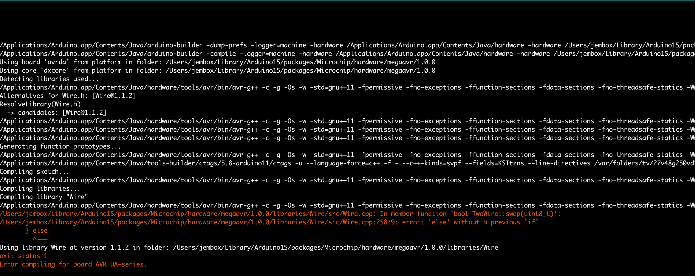

## Testing Digital Potentiometer_Errors

```sh
// I2C Digital Potentiometer
// by Nicholas Zambetti <http://www.zambetti.com>
// and Shawn Bonkowski <http://people.interaction-ivrea.it/s.bonkowski/>

// Demonstrates use of the Wire library
// Controls AD5171 digital potentiometer via I2C/TWI

// Created 31 March 2006

// This example code is in the public domain.

#include <Wire.h>

void setup() {
  Wire.begin(); // join i2c bus (address optional for master)
}

byte val = 0;

void loop() {
  Wire.beginTransmission(44); // transmit to device #44 (0x2c)
  // device address is specified in datasheet
  Wire.write(byte(0x00));            // sends instruction byte
  Wire.write(val);             // sends potentiometer value byte
  Wire.endTransmission();     // stop transmitting

  val++;        // increment value
  if (val == 64) { // if reached 64th position (max)
    val = 0;    // start over from lowest value
  }
  delay(500);
}

```

## Errors

[]

## Potential Bug Fixes

Fix compiler errors in the file:
    Arduino15/packages/Microchip/hardware/megaavr/1.0.0/libraries/Wire/src/Wire.cpp


## Sketch Upload after fix:

    []

    []
