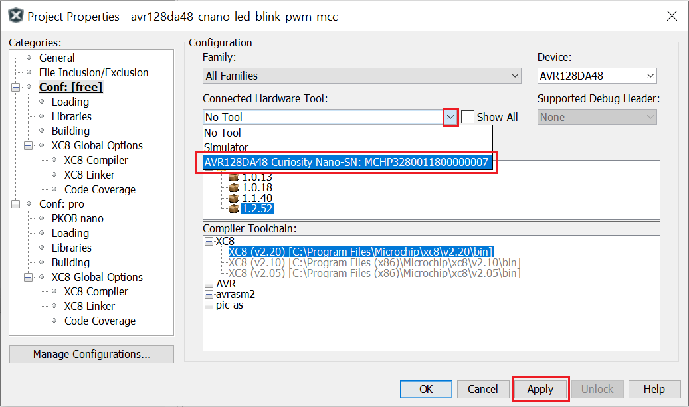
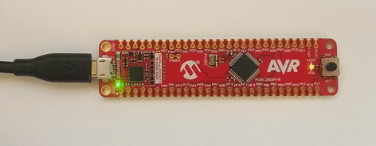

# AVR128DA48 LED Blink using PWM Code Example

This repository provides a MPLAB X project with a MCC generated code example for an LED blink driven by a PWM signal. The example demonstrates how to generate a PWM signal using a timer. The output waveform is connected to the on-board LED. The PWM duty cycle value is set at 50%. For half of the period the LED is turned ON, and for the other half the LED is turned OFF.

## Related Documentation
More details and code examples on the AVR128DA48 can be found at the following links:
- [AVR128DA48 Product Page](https://www.microchip.com/wwwproducts/en/AVR128DA28)
- [AVR128DA48 Code Examples on GitHub](https://github.com/microchip-pic-avr-examples?q=avr128da48)
- [AVR128DA48 Project Examples in START](https://start.atmel.com/#examples/AVR128DA48CuriosityNano)

## Software Used
- MPLAB® X IDE 5.45 or newer [(microchip.com/mplab/mplab-x-ide)](http://www.microchip.com/mplab/mplab-x-ide)
- MPLAB® XC8 2.31 or a newer compiler [(microchip.com/mplab/compilers)](http://www.microchip.com/mplab/compilers)
- MPLAB® Code Configurator (MCC) 4.1.0 or newer [(microchip.com/mplab/mplab-code-configurator)](https://www.microchip.com/mplab/mplab-code-configurator)
- MPLAB® Code Configurator (MCC) Device Libraries 8-bit AVR MCUs 2.5.0 or newer [(microchip.com/mplab/mplab-code-configurator)](https://www.microchip.com/mplab/mplab-code-configurator)
- AVR-Dx 1.8.112 or newer Device Pack

## Hardware Used
- AVR128DA48 Curiosity Nano [(DM164151)](https://www.microchip.com/Developmenttools/ProductDetails/DM164151)

## Setup
The AVR128DA48 Curiosity Nano Development Board is used as test platform
 

The following configurations must be made for this project:

Clock:
- 4 MHz clock with Prescaler Division of 16 (250 kHz actual)

TCA1:
- Single-slope PWM Mode
- Compare channel 2 enabled with 50% duty cycle
- System clock 250 kHz
- Requested timeout 262ms

|Pin           | Configuration      |
| :----------: | :----------------: |
|PC6 (LED0)    | Digital Output     |

## Operation
1. Connect the board to the PC.

2. Open the *avr128da48-cnano-led-blink-pwm-mcc.X* project in MPLAB® X IDE.

3. Set *avr128da48-cnano-led-blink-pwm-mcc.X* project as main project. Right click on the project in the *Projects* tab and click *Set as Main Project*.

4. Select the *AVR128DA28 Curiosity Nano* in the *Connected Hardware Tool* section of the project settings:
  - Right click on the project and click *Properties*;
  - Click on the arrow right next to *Connected Hardware Tool*;
  - Select the *AVR128DA28 Curiosity Nano* (click on the SN), click *Apply* and then click *OK*:
 

5. Program the project to the board: right click on the project and click *Make and Program Device*.

Demo:
 

## Summary
The demo shows how to generate a PWM signal using Timer/Counter Type A (TCA). The output of the TCA is connected to the on-board LED of the AVR128DA48 Curiosity Nano board and a waveform signal is generated.
