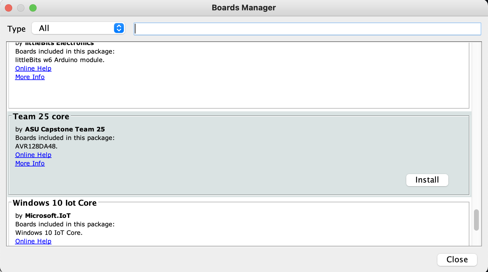
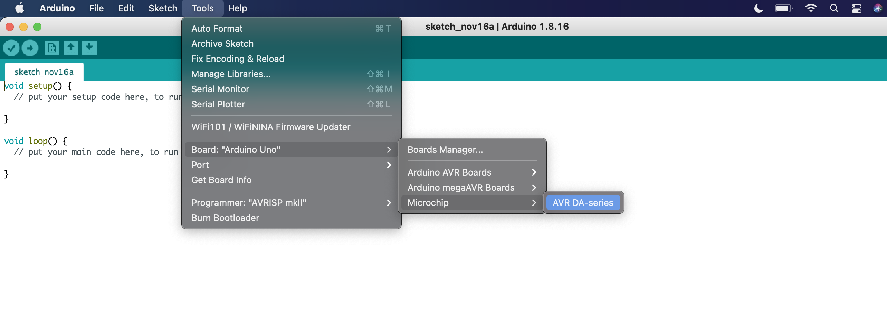
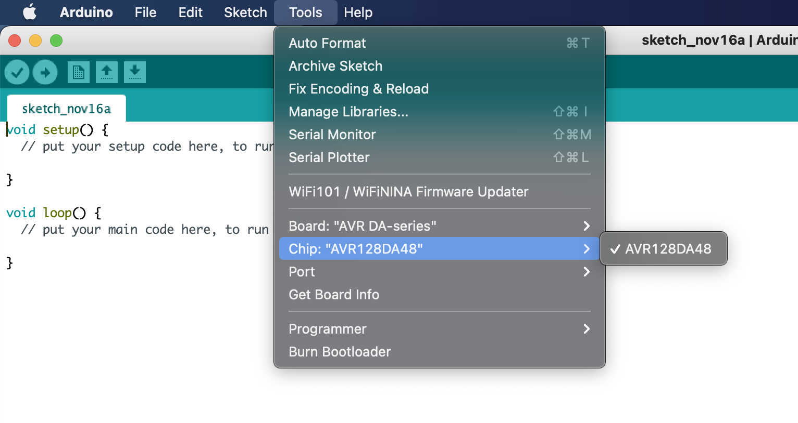

# General Instructions for Arduino Setup on the Apple Arm Processor

1. Download the correct zip file for Mac_OS

    

2. Find the file in the appropriate file path
3. Extract file [arduino-x.x.xx-macosx.zip] by double clicking
4. Follow the prompts to complete installation
5. Drag and drop the Arduino icon into the Applications folder when prompted

    []

# One-Time Setup

1. Update JSON path under file > preferences under Additional Boards Manager URL's:

    > https://github.com/Emsloan/Microchip-DA48/raw/package_index/package_Team25Capstone_avrdude_index.json

2. Go to Tools > Boards Manager to install Team25 Core:
[]

3. Verify that it has been installed under Tools > Board > Microchip:
[]

4. A new menu option should now be visible under Tools > Chip > AVR128DA48
[]

# Troubleshooting

Clear cache of Arduino application data by pressing cmd + space and searching/checking each of the following file paths:
    > ~/Library/Caches
    > ~/Library/Application Support
    > /Library/Caches
    > /Library/Application Support
