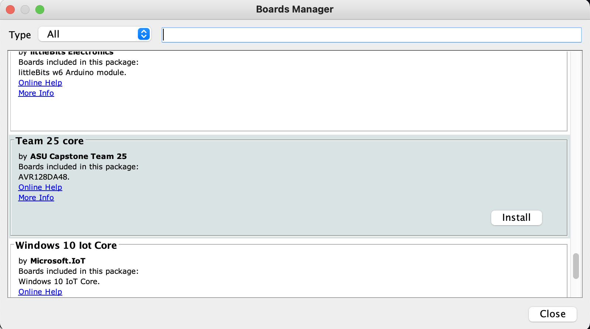
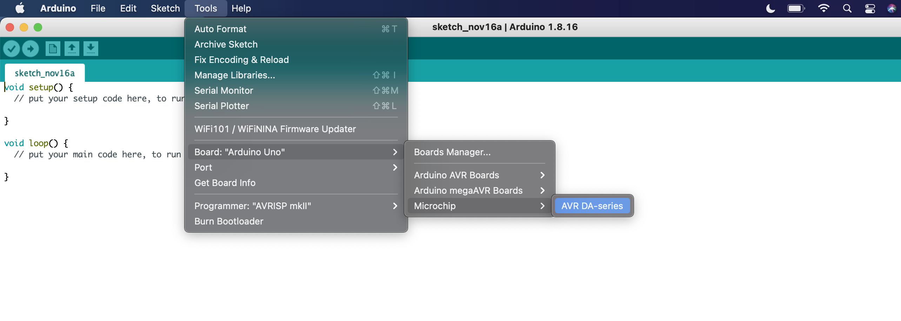

1. Clear cache of Arduino application data by pressing cmd + space and searching/checking each of the following file paths:
~/Library/Caches
~/Library/Application Support
/Library/Caches
/Library/Application Support
Update JSON path under file > preferences under Additional Boards Manager URL's: https://github.com/Emsloan/Microchip-DA48/raw/package_index/package_Team25Capstone_avrdude_index.json

2. Go to Tools > Boards Manager to install Team25 Core: 
[]

3. Verify that it has been installed under Tools > Board > Microchip: 
[]

4. A new menu option should now be visible under Tools > Chip > AVR128DA48
[]