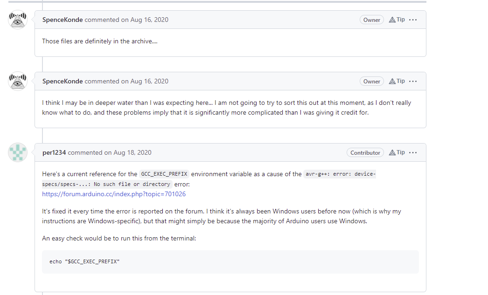
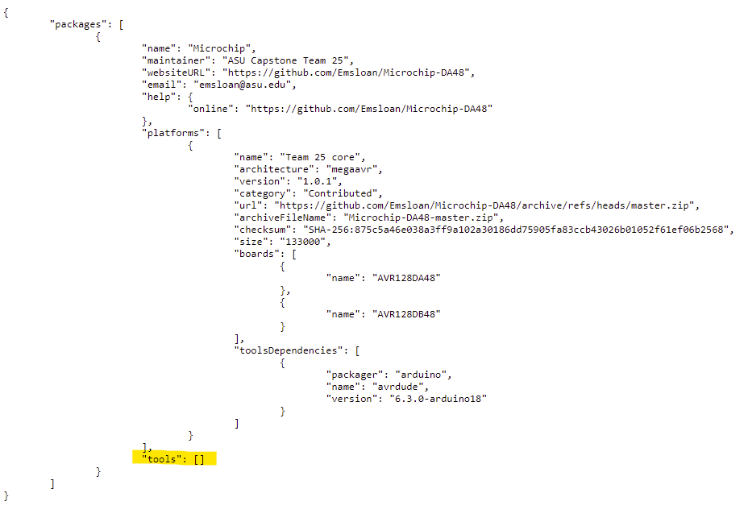

# Issue with device-specs/specs-avr128db48

Error when uploading to the AVR128DB48
```
C:\Program Files (x86)\Arduino\arduino-builder -dump-prefs -logger=machine -hardware C:\Program Files (x86)\Arduino\hardware -hardware C:\Users\paulm\AppData\Local\Arduino15\packages -tools C:\Program Files (x86)\Arduino\tools-builder -tools C:\Program Files (x86)\Arduino\hardware\tools\avr -tools C:\Users\paulm\AppData\Local\Arduino15\packages -built-in-libraries C:\Program Files (x86)\Arduino\libraries -libraries C:\Users\paulm\OneDrive\Documents\Arduino\libraries -fqbn=Microchip:megaavr:avrdb:chip=avr128db48 -vid-pid=03EB_2175 -ide-version=10819 -build-path C:\Users\paulm\AppData\Local\Temp\arduino_build_595628 -warnings=none -build-cache C:\Users\paulm\AppData\Local\Temp\arduino_cache_602275 -prefs=build.warn_data_percentage=75 -prefs=runtime.tools.avrdude.path=C:\Users\paulm\AppData\Local\Arduino15\packages\arduino\tools\avrdude\6.3.0-arduino18 -prefs=runtime.tools.avrdude-6.3.0-arduino18.path=C:\Users\paulm\AppData\Local\Arduino15\packages\arduino\tools\avrdude\6.3.0-arduino18 -verbose C:\Users\paulm\AppData\Local\Temp\untitled2006265873.tmp\sketch_feb13a\sketch_feb13a.ino
C:\Program Files (x86)\Arduino\arduino-builder -compile -logger=machine -hardware C:\Program Files (x86)\Arduino\hardware -hardware C:\Users\paulm\AppData\Local\Arduino15\packages -tools C:\Program Files (x86)\Arduino\tools-builder -tools C:\Program Files (x86)\Arduino\hardware\tools\avr -tools C:\Users\paulm\AppData\Local\Arduino15\packages -built-in-libraries C:\Program Files (x86)\Arduino\libraries -libraries C:\Users\paulm\OneDrive\Documents\Arduino\libraries -fqbn=Microchip:megaavr:avrdb:chip=avr128db48 -vid-pid=03EB_2175 -ide-version=10819 -build-path C:\Users\paulm\AppData\Local\Temp\arduino_build_595628 -warnings=none -build-cache C:\Users\paulm\AppData\Local\Temp\arduino_cache_602275 -prefs=build.warn_data_percentage=75 -prefs=runtime.tools.avrdude.path=C:\Users\paulm\AppData\Local\Arduino15\packages\arduino\tools\avrdude\6.3.0-arduino18 -prefs=runtime.tools.avrdude-6.3.0-arduino18.path=C:\Users\paulm\AppData\Local\Arduino15\packages\arduino\tools\avrdude\6.3.0-arduino18 -verbose C:\Users\paulm\AppData\Local\Temp\untitled2006265873.tmp\sketch_feb13a\sketch_feb13a.ino
Using board 'avrdb' from platform in folder: C:\Users\paulm\AppData\Local\Arduino15\packages\Microchip\hardware\megaavr\1.0.1
Using core 'dxcore' from platform in folder: C:\Users\paulm\AppData\Local\Arduino15\packages\Microchip\hardware\megaavr\1.0.1
Detecting libraries used...
"C:\\Program Files (x86)\\Arduino\\hardware\\tools\\avr/bin/avr-g++" -c -g -Os -Wall -std=gnu++17 -fpermissive -Wno-sized-deallocation -fno-exceptions -ffunction-sections -fdata-sections -fno-threadsafe-statics -Wno-error=narrowing -flto -mrelax -w -x c++ -E -CC -mmcu=avr128db48 -DF_CPU=24000000L -DCLOCK_SOURCE=0 -DCORE_ATTACH_ALL -DTWI_MORS_SINGLE -DMILLIS_USE_TIMERB2 -DARDUINO=10819 -DARDUINO_avrdb -DARDUINO_ARCH_MEGAAVR "-DDXCORE=\"1.0.1\"" -DDXCORE_MAJOR=1UL -DDXCORE_MINOR=0UL -DDXCORE_PATCH=1UL -DDXCORE_RELEASED=0 "-IC:\\Users\\paulm\\AppData\\Local\\Arduino15\\packages\\Microchip\\hardware\\megaavr\\1.0.1\\cores\\dxcore/api/deprecated" "-IC:\\Users\\paulm\\AppData\\Local\\Arduino15\\packages\\Microchip\\hardware\\megaavr\\1.0.1\\cores\\dxcore" "-IC:\\Users\\paulm\\AppData\\Local\\Arduino15\\packages\\Microchip\\hardware\\megaavr\\1.0.1\\variants\\48pin-standard" "C:\\Users\\paulm\\AppData\\Local\\Temp\\arduino_build_595628\\sketch\\sketch_feb13a.ino.cpp" -o nul
Error while detecting libraries included by C:\Users\paulm\AppData\Local\Temp\arduino_build_595628\sketch\sketch_feb13a.ino.cpp
Generating function prototypes...
"C:\\Program Files (x86)\\Arduino\\hardware\\tools\\avr/bin/avr-g++" -c -g -Os -Wall -std=gnu++17 -fpermissive -Wno-sized-deallocation -fno-exceptions -ffunction-sections -fdata-sections -fno-threadsafe-statics -Wno-error=narrowing -flto -mrelax -w -x c++ -E -CC -mmcu=avr128db48 -DF_CPU=24000000L -DCLOCK_SOURCE=0 -DCORE_ATTACH_ALL -DTWI_MORS_SINGLE -DMILLIS_USE_TIMERB2 -DARDUINO=10819 -DARDUINO_avrdb -DARDUINO_ARCH_MEGAAVR "-DDXCORE=\"1.0.1\"" -DDXCORE_MAJOR=1UL -DDXCORE_MINOR=0UL -DDXCORE_PATCH=1UL -DDXCORE_RELEASED=0 "-IC:\\Users\\paulm\\AppData\\Local\\Arduino15\\packages\\Microchip\\hardware\\megaavr\\1.0.1\\cores\\dxcore/api/deprecated" "-IC:\\Users\\paulm\\AppData\\Local\\Arduino15\\packages\\Microchip\\hardware\\megaavr\\1.0.1\\cores\\dxcore" "-IC:\\Users\\paulm\\AppData\\Local\\Arduino15\\packages\\Microchip\\hardware\\megaavr\\1.0.1\\variants\\48pin-standard" "C:\\Users\\paulm\\AppData\\Local\\Temp\\arduino_build_595628\\sketch\\sketch_feb13a.ino.cpp" -o "C:\\Users\\paulm\\AppData\\Local\\Temp\\arduino_build_595628\\preproc\\ctags_target_for_gcc_minus_e.cpp"
avr-g++: error: device-specs/specs-avr128db48: No such file or directory
exit status 1
Error compiling for board AVR128DB48 Curiosity Nano.
```

Spence Konde has encountered this error before:


### Possible Reasons for the Error
When Spence's original DxCore is install alongside Team 25's repo, the IDE is then capable of uploading a sketch to the AVR128DB48.
It appears the IDE will use the avr-gcc tool that is installed with the DxCore rather than the default version that is downloaded with 
the IDE.

Before the DxCore is installed:
``` 
"C:\\Program Files (x86)\\Arduino\\hardware\\tools\\avr/bin/avr-g++" 
```

After the DxCore is installed:
```
"C:\\Users\\paulm\\AppData\\Local\\Arduino15\\packages\\DxCore\\tools\\avr-gcc\\7.3.0-atmel3.6.1-azduino4b/bin/avr-gcc"
```

The IDE chooses this version automatically even though it is not associated with the Microchip core package. 

### Possible Fixes
The Microchip core package needs to function properly without requiring users to also download the DxCore.  For this reason, the JSON file must be updated 
to allow for the 7.3.0-atmel3.6.1-azduino4b to be downloaded into the Team's tools folder.  The IDE will install this tool when the core package is 
downloaded if a reference to the tool is made in the JSON file.  

