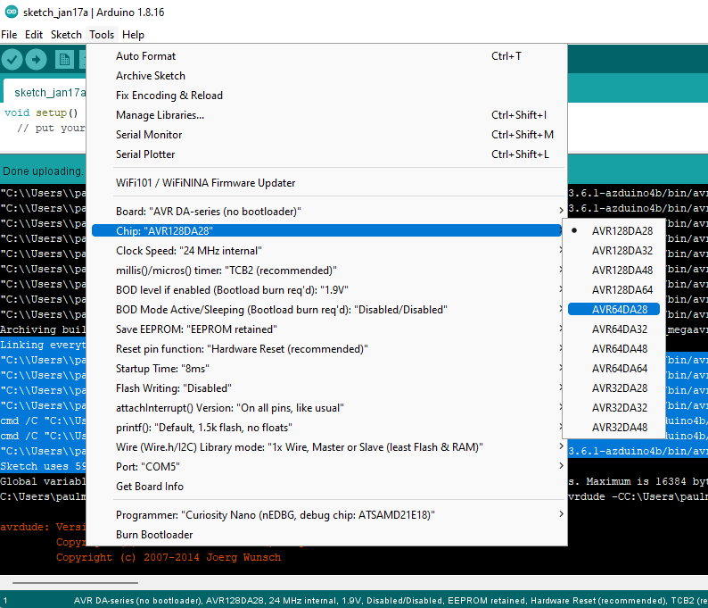

# Compiler Flag Location 

Compiler flags are set in both the boards.txt and platform.txt.  

# Compiler Flags in boards.txt
The flags set in boards.txt are used for 
built-in variables that apply to all arduino boards that can be used with the IDE.  These variables include
such options as cpu type and speed at which the chip will operate.  These variables can be set through the menu selection or 
set to a default through in boards.txt.

### Setting default variables 
```
# Clock Speed + Source
avrda.build.f_cpu=24000000L
avrda.build.speed=24
avrda.build.clocksource=0
``` 

The avrda indicates the board being uploaded to, the build indicates the property is part of the build options, 
and the last portion indicates the default property being set by the flag.

### Choosing variable options through the IDE menu

Figure 1: Arduino IDE DxCore menu choices

Choosing a menu option will set that variable to the selection once the sketch is compiled and uploaded to 
the arduino board.

Menu options are created in boards.txt in this manner:

```
# Chip (pins and memory size)

avrda.menu.chip.128DA48=AVR128DA48
avrda.menu.chip.128DA48.build.mcu=avr128da48
avrda.menu.chip.128DA48.upload.maximum_size=131072
avrda.menu.chip.128DA48.upload.maximum_data_size=16384
avrda.menu.chip.128DA48.build.variant=48pin-standard
```

These options are set by the boards.txt file but are later used in the platforms.txt file to create the compiler
commands that will be executed when the core is compiled.

# Compiler Flags in platforms.txt

 The compiler flags are set in the platforms.txt file
```
#####################
# Compile Parameter #
#####################

# Force users to see warnings, since it defaults to them being off if you let the IDE have it's way.
compiler.warning_flags=-Wall
compiler.warning_flags.none=-Wall
compiler.warning_flags.default=-Wall
compiler.warning_flags.more=-Wall
compiler.warning_flags.all=-Wall -Wextra

# Default "compiler.path" is correct, change only if you want to override the initial value
compiler.path={runtime.tools.avr-gcc.path}/bin/
compiler.c.cmd=avr-gcc
compiler.c.flags=-c -g -Os {compiler.warning_flags} -std=gnu11 -ffunction-sections -fdata-sections -MMD -flto -fno-fat-lto-objects -mrelax -Werror=implicit-function-declaration -Wundef
# DxCore has the three additional FLMAP sections for mapped flash
compiler.c.elf.flags={compiler.warning_flags} -Os -g -flto -fuse-linker-plugin -mrelax -Wl,--gc-sections,--section-start={build.text_section_start},--section-start=.FLMAP_SECTION1=0x8000,--section-start=.FLMAP_SECTION2=0x10000,--section-start=.FLMAP_SECTION3=0x18000
compiler.c.elf.cmd=avr-gcc
compiler.S.flags=-c -g -x assembler-with-cpp -flto -MMD
compiler.cpp.cmd=avr-g++
compiler.cpp.flags=-c -g -Os {compiler.warning_flags} -std=gnu++17 -fpermissive -Wno-sized-deallocation -fno-exceptions -ffunction-sections -fdata-sections -fno-threadsafe-statics -Wno-error=narrowing -MMD -flto -mrelax
compiler.ar.cmd=avr-gcc-ar
compiler.ar.flags=rcs
compiler.objcopy.cmd=avr-objcopy
compiler.objcopy.eep.flags=-O ihex -j .eeprom --set-section-flags=.eeprom=alloc,load --no-change-warnings --change-section-lma .eeprom=0
compiler.objdump.cmd=avr-objdump
compiler.objdump.flags=--disassemble --source --line-numbers --demangle --section=.text
compiler.nm.cmd=avr-nm
compiler.nm.flags=--numeric-sort --line-numbers --demangle --print-size --format=s
compiler.elf2hex.flags=-O ihex -R .eeprom
compiler.elf2hex.bin.flags=-O binary -R .eeprom
compiler.elf2hex.cmd=avr-objcopy
compiler.ldflags=
compiler.libraries.ldflags=
compiler.size.cmd=avr-size
```

The variables set by the IDE's menu and in boards.txt are used in platforms.txt in this manner:
```
####################
# Compile Patterns #
####################

## Compile c files
recipe.c.o.pattern="{compiler.path}{compiler.c.cmd}" {compiler.c.flags} -mmcu={build.mcu} {build.optiondefines} {build.versiondefines} {compiler.c.extra_flags} {build.extra_flags} "-I{build.core.path}/api/deprecated" {includes} "{source_file}" -o "{object_file}"

## Compile c++ files
recipe.cpp.o.pattern="{compiler.path}{compiler.cpp.cmd}" {compiler.cpp.flags} -mmcu={build.mcu} {build.optiondefines} {build.versiondefines} {compiler.cpp.extra_flags} {build.extra_flags} "-I{build.core.path}/api/deprecated" {includes} "{source_file}" -o "{object_file}"

## Compile S files
recipe.S.o.pattern="{compiler.path}{compiler.c.cmd}" {compiler.S.flags} -mmcu={build.mcu} {build.optiondefines} {build.versiondefines} {compiler.S.extra_flags} {build.extra_flags} "-I{build.core.path}/api/deprecated" {includes} "{source_file}" -o "{object_file}"

## Preprocessor
# These two are used during the lib discovery phase and for function prototype generation
preproc.includes.flags=-w -x c++ -M -MG -MP
recipe.preproc.includes="{compiler.path}{compiler.cpp.cmd}" {compiler.cpp.flags} {preproc.includes.flags} -mmcu={build.mcu} {build.optiondefines} {build.versiondefines} {compiler.cpp.extra_flags} {build.extra_flags} "-I{build.core.path}/api/deprecated" {includes} "{source_file}"
preproc.macros.flags=-w -x c++ -E -CC
recipe.preproc.macros="{compiler.path}{compiler.cpp.cmd}" {compiler.cpp.flags} {preproc.macros.flags} -mmcu={build.mcu}  {build.optiondefines} {build.versiondefines} {compiler.cpp.extra_flags} {build.extra_flags} "-I{build.core.path}/api/deprecated" {includes} "{source_file}" -o "{preprocessed_file_path}"

```
Compiler recipes are written in platforms.txt and can be modified in this file.

In the IDE the compiler flags can be view in to verbose output window.
```
Detecting libraries used...
"C:\\Users\\paulm\\AppData\\Local\\Arduino15\\packages\\DxCore\\tools\\avr-gcc\\7.3.0-atmel3.6.1-azduino4b/bin/avr-g++" -c -g -Os -Wall -std=gnu++17 -fpermissive -Wno-sized-deallocation -fno-exceptions -ffunction-sections -fdata-sections -fno-threadsafe-statics -Wno-error=narrowing -flto -mrelax -w -x c++ -E -CC -mmcu=avr128da48 -DF_CPU=24000000L -DCLOCK_SOURCE=0 -DCORE_ATTACH_ALL -DTWI_MORS_SINGLE -DMILLIS_USE_TIMERB2 -DARDUINO=10816 -DARDUINO_avrda -DARDUINO_ARCH_MEGAAVR "-DDXCORE=\"1.4.6\"" -DDXCORE_MAJOR=1UL -DDXCORE_MINOR=4UL -DDXCORE_PATCH=6UL -DDXCORE_RELEASED=0 "-IC:\\Users\\paulm\\AppData\\Local\\Arduino15\\packages\\DxCore\\hardware\\megaavr\\1.4.6\\cores\\dxcore/api/deprecated" "-IC:\\Users\\paulm\\AppData\\Local\\Arduino15\\packages\\DxCore\\hardware\\megaavr\\1.4.6\\cores\\dxcore" "-IC:\\Users\\paulm\\AppData\\Local\\Arduino15\\packages\\DxCore\\hardware\\megaavr\\1.4.6\\variants\\48pin-standard" "C:\\Users\\paulm\\AppData\\Local\\Temp\\arduino_build_352325\\sketch\\sketch_jan17a.ino.cpp" -o nul
Generating function prototypes...
"C:\\Users\\paulm\\AppData\\Local\\Arduino15\\packages\\DxCore\\tools\\avr-gcc\\7.3.0-atmel3.6.1-azduino4b/bin/avr-g++" -c -g -Os -Wall -std=gnu++17 -fpermissive -Wno-sized-deallocation -fno-exceptions -ffunction-sections -fdata-sections -fno-threadsafe-statics -Wno-error=narrowing -flto -mrelax -w -x c++ -E -CC -mmcu=avr128da48 -DF_CPU=24000000L -DCLOCK_SOURCE=0 -DCORE_ATTACH_ALL -DTWI_MORS_SINGLE -DMILLIS_USE_TIMERB2 -DARDUINO=10816 -DARDUINO_avrda -DARDUINO_ARCH_MEGAAVR "-DDXCORE=\"1.4.6\"" -DDXCORE_MAJOR=1UL -DDXCORE_MINOR=4UL -DDXCORE_PATCH=6UL -DDXCORE_RELEASED=0 "-IC:\\Users\\paulm\\AppData\\Local\\Arduino15\\packages\\DxCore\\hardware\\megaavr\\1.4.6\\cores\\dxcore/api/deprecated" "-IC:\\Users\\paulm\\AppData\\Local\\Arduino15\\packages\\DxCore\\hardware\\megaavr\\1.4.6\\cores\\dxcore" "-IC:\\Users\\paulm\\AppData\\Local\\Arduino15\\packages\\DxCore\\hardware\\megaavr\\1.4.6\\variants\\48pin-standard" "C:\\Users\\paulm\\AppData\\Local\\Temp\\arduino_build_352325\\sketch\\sketch_jan17a.ino.cpp" -o "C:\\Users\\paulm\\AppData\\Local\\Temp\\arduino_build_352325\\preproc\\ctags_target_for_gcc_minus_e.cpp"
"C:\\Users\\paulm\\Downloads\\arduino-1.8.16-windows\\arduino-1.8.16\\tools-builder\\ctags\\5.8-arduino11/ctags" -u --language-force=c++ -f - --c++-kinds=svpf --fields=KSTtzns --line-directives "C:\\Users\\paulm\\AppData\\Local\\Temp\\arduino_build_352325\\preproc\\ctags_target_for_gcc_minus_e.cpp"
Compiling sketch...
"C:\\Users\\paulm\\AppData\\Local\\Arduino15\\packages\\DxCore\\tools\\avr-gcc\\7.3.0-atmel3.6.1-azduino4b/bin/avr-g++" -c -g -Os -Wall -std=gnu++17 -fpermissive -Wno-sized-deallocation -fno-exceptions -ffunction-sections -fdata-sections -fno-threadsafe-statics -Wno-error=narrowing -MMD -flto -mrelax -mmcu=avr128da48 -DF_CPU=24000000L -DCLOCK_SOURCE=0 -DCORE_ATTACH_ALL -DTWI_MORS_SINGLE -DMILLIS_USE_TIMERB2 -DARDUINO=10816 -DARDUINO_avrda -DARDUINO_ARCH_MEGAAVR "-DDXCORE=\"1.4.6\"" -DDXCORE_MAJOR=1UL -DDXCORE_MINOR=4UL -DDXCORE_PATCH=6UL -DDXCORE_RELEASED=0 "-IC:\\Users\\paulm\\AppData\\Local\\Arduino15\\packages\\DxCore\\hardware\\megaavr\\1.4.6\\cores\\dxcore/api/deprecated" "-IC:\\Users\\paulm\\AppData\\Local\\Arduino15\\packages\\DxCore\\hardware\\megaavr\\1.4.6\\cores\\dxcore" "-IC:\\Users\\paulm\\AppData\\Local\\Arduino15\\packages\\DxCore\\hardware\\megaavr\\1.4.6\\variants\\48pin-standard" "C:\\Users\\paulm\\AppData\\Local\\Temp\\arduino_build_352325\\sketch\\sketch_jan17a.ino.cpp" -o "C:\\Users\\paulm\\AppData\\Local\\Temp\\arduino_build_352325\\sketch\\sketch_jan17a.ino.cpp.o"
Compiling libraries...
Compiling core...
```